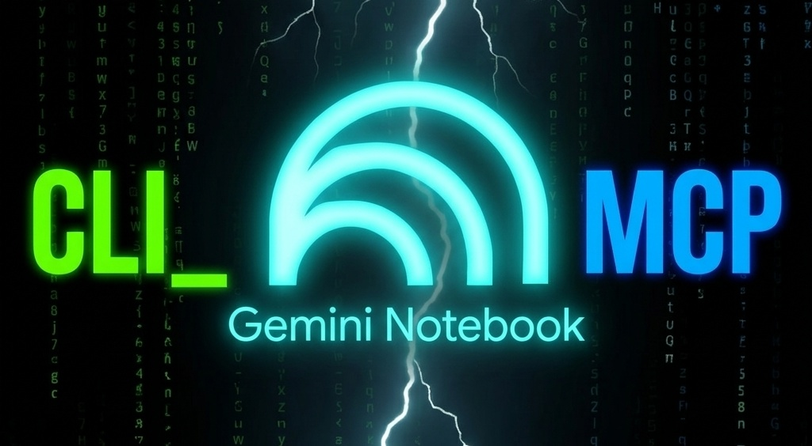

# Gemini Notebook (formerly Google NotebookLM) CLI & MCP Server



[](https://pypi.org/project/notebooklm-mcp-cli/)
[](https://pypistats.org/packages/notebooklm-mcp-cli)
[](https://pepy.tech/projects/notebooklm-mcp-cli)
[](https://pypi.org/project/notebooklm-mcp-cli/)
[](https://github.com/jacob-bd/gemini-notebook-mcp-cli/blob/main/LICENSE)

## What's New (mp3wizard fork)

### Upstream sync (v0.11.5 — September 2026)
- **Headless auth refresh hardening (#330)** — the headless refresh now picks a free port instead of a hardcoded 9223, so a foreign process already holding that port can't make Chrome bind elsewhere while the tool probes the wrong CDP listener; `nlm login --clear` now always clears and re-authenticates instead of returning early when the saved session still validates; new `NOTEBOOKLM_DISABLE_HEADLESS_REFRESH=1` opts out of the automatic self-heal and `nlm auth refresh` for Workspace accounts whose session is revoked server-side on relaunch. Reported by **@cr4shOverr1de**.
- Also bumped `astral-sh/setup-uv` 7.6.0→10.1.0 in CI (dependabot, #329).

### Security scan (September 2026 — v0.11.5 merge)
- Full automated scan post-merge: Gitleaks, Bandit, Semgrep (OWASP/Python/secrets), TruffleHog, OSV-Scanner, mcps-audit, config-audit, skill-audit
- **0 real findings requiring a fix** — 1 Bandit Medium and 137 mcps-audit High/Critical were individually reviewed against source and confirmed false positives (test fixtures, a hardcoded PyPI version-check URL, local CDP debug scripts not shipped in the package, safe JSON deserialization misread as an "injection pattern", and the scanner's autonomous-agent heuristics misreading this CLI's `--confirm`/`-y` flags as "excessive agency")
- **0 secrets** (Gitleaks, TruffleHog, OSV-Scanner clean; TruffleHog's 6 hits are the same recurring example-URI false positive in old scan-report docs), **0 dependency vulnerabilities** (OSV-Scanner, 90 packages)
- **Coverage gaps this run:** Trivy failed twice on a DB-download network reset (not retried a third time; OSV-Scanner covered dependency vulns instead); `mcp-exfil-scan.sh`'s bundled-script checksum still doesn't match `SHA256SUMS` — plugin needs reinstalling before it can run again
- Full report: [`docs/security-scan-report-2026-09-18.md`](docs/security-scan-report-2026-09-18.md)

### Upstream sync (v0.11.4 — September 2026)
- **Plan usage reporting (#327)** — `nlm usage` and the MCP `usage_get` tool report percentage used/remaining, reset timestamp, and subscription tier for the rolling (~5h) and weekly compute windows. Thanks to **@WAOmaster**!
- **Isolated usage checks for named profiles (#328)** — `nlm usage --profile <name>` / `usage_get(profile="<name>")` inspect a saved profile without touching the configured default or the MCP server's shared client; an explicit CLI profile now takes precedence over `NOTEBOOKLM_COOKIES`, and a missing profile fails instead of silently checking another account. Thanks to **@insane66613**!
- **Known limitation:** Enterprise "Pro"-tier accounts may get no usage windows back from Google, so `nlm usage`/`usage_get` can't show allowance data even though other operations work normally.

### Security scan (September 2026 — v0.11.4 merge)
- Full automated scan post-merge: Gitleaks, Bandit, Semgrep (OWASP/Python/secrets), Trivy, TruffleHog, OSV-Scanner, config-audit, skill-audit
- **0 High/Critical/Medium findings** — clean merge, no security fixes shipped upstream this cycle (0.11.3/0.11.4 are feature/correctness patches)
- **0 secrets** (Gitleaks, Trivy, OSV-Scanner clean; TruffleHog's 5 hits confirmed non-secret example-URI false positives in old scan-report docs), **0 dependency vulnerabilities** (OSV-Scanner + Trivy, 90 packages)
- config-audit's Medium findings and the `SKILL.md` skill-audit CRITICAL verdict reviewed and confirmed false positives (unchanged pattern from prior scans) — the tool's own auth/UX documentation misread as dangerous instructions
- Also finished a stale merge left over from a prior interrupted run (`CLAUDE.md` conflicts, resolved)
- **Coverage gap:** `mcp-exfil-scan.sh`'s bundled-script checksum still doesn't match `SHA256SUMS` (3rd consecutive run) — plugin needs reinstalling before the next scheduled run
- Full report: [`docs/security-scan-report-2026-09-14.md`](docs/security-scan-report-2026-09-14.md)

### Security release — v0.11.1 (September 2026, upstream)
- **Pipeline names validated against path traversal ([GHSA-596g-p98x-c7hw](https://github.com/jacob-bd/gemini-notebook-mcp-cli/security/advisories/GHSA-596g-p98x-c7hw))** — `_load_pipeline` (MCP `pipeline` tool) and `pipeline_create` (CLI) interpolated a caller-supplied pipeline name straight into a filesystem path; a name containing `..` or an absolute path escaped the pipelines directory, letting a crafted name load and run any `.yaml` on disk as a pipeline (bounded to whitelisted actions, including `notebook_delete`) or write outside the directory. Names are now validated as identifiers. Reported by **@Naor-Peretz**.

### Security scan (September 2026 — v0.11.1 merge)
- Full automated scan post-merge: Gitleaks, Bandit, Semgrep (OWASP/Python/secrets), Trivy, TruffleHog, OSV-Scanner, mcps-audit, config-audit, skill-audit
- **3 findings fixed** — `cryptography` 49.0.0→50.0.1 (High, CVE-2026-69247), `click` 8.3.2→8.5.0 (High, PYSEC-2026-2132), `pydantic-settings` 2.13.1→2.15.0 (Medium, GHSA-4xgf-cpjx-pc3j). All three were introduced transitively while regenerating `uv.lock` during the merge, not from new upstream commits. Re-verified clean with OSV-Scanner; full test suite re-run clean (1580 passed).
- Kept the local, stricter `fastmcp>=3.2.0,<4.0` pin (CVE-2026-32871) over origin's looser `fastmcp>=2.0.0,<5.0` during the merge conflict.
- mcps-audit's 574 findings, config-audit's Medium findings, and the `SKILL.md` skill-audit CRITICAL verdict reviewed and confirmed false positives (unchanged from the prior scan) — dev-only CDP debug scripts, RPC constant names, and the skill's own auth/UX documentation misread as dangerous instructions.
- Full report: [`docs/security-scan-report-2026-09-09.md`](docs/security-scan-report-2026-09-09.md)

### Upstream sync (v0.11.0 — September 2026)
- **`nlm auth refresh` — non-interactive session refresh (#316)** — headless-browser pass against the saved profile so schedulers (cron/launchd) can keep an unattended session alive without an interactive `nlm login`. Exits non-zero on failure; refuses when `NOTEBOOKLM_COOKIES` overrides saved credentials. Suggested by **@Scouer**.
- **Sessions no longer die after ~8 hours (#316)** — auth recovery re-extracts the CSRF token after a disk/headless cookie swap instead of retrying with a blanked token; the headless-browser refresh path (previously unreachable) now revives aged-out sessions. Diagnosed and verified live by **@Scouer**.
- **CI: `actions/checkout` pinned to v6 across all workflows (#317)** — drops the Node 20 deprecation warning GitHub force-runs on v4.

### Security release — v0.10.1 (September 2026, upstream)
- **Artifact downloads confined to an approved directory ([GHSA-92q4-9x75-55rf](https://github.com/jacob-bd/gemini-notebook-mcp-cli/security/advisories/GHSA-92q4-9x75-55rf))** — the prior denylist-based `validate_output_path` left every unlisted path writable; a prompt injection in notebook source content could steer an MCP client into overwriting shell startup files, agent instruction files, or git hooks. MCP download tools now confine every write to a single resolved download directory (`NOTEBOOKLM_DOWNLOAD_DIR`, default `~/Downloads/gemini-notebook`). CLI downloads are unchanged — that path comes from the person running the command, not a model. Reported by **@Naor-Peretz**.

### Security scan (September 2026 — v0.11.0 merge)
- Full automated scan post-merge: Gitleaks, Bandit, Semgrep (OWASP/Python/secrets), Trivy, TruffleHog, OSV-Scanner, mcps-audit, config-audit, skill-audit
- **1 Medium fixed** (Bandit `B108`) — a `# nosec` suppression comment sat on the wrong line (a continuation line, not the flagged string literal) so it silently didn't apply; moved to the correct line. 0 High/Critical
- **0 secrets** (Gitleaks, Trivy, OSV-Scanner clean; TruffleHog's 3 hits confirmed non-secret example-URI false positives in old scan-report docs), **0 dependency vulnerabilities** (OSV-Scanner + Trivy, 88 packages)
- mcps-audit's 566 findings and config-audit's project-scoped Medium/Low findings reviewed and confirmed false positives — CDP browser-automation scripts in `scripts/` (dev-only, not packaged) misread as "dangerous execution", RPC constant names containing `DELETE` misread as privilege escalation, and doc mentions of "verify"/"cookies" misread as suspicious instructions in an authentication tool's own documentation
- **Coverage gap this run:** `mcp-exfil-scan.sh`'s bundled-script checksum didn't match `SHA256SUMS` — skipped per the tamper-evidence rule rather than running a possibly-modified script. Flagged for the plugin to be reinstalled/verified before the next scheduled run. mcp-scan and skillspector LLM-mode skipped (opt-in, unattended run)
- Full report: [`docs/security-scan-report-2026-09-07.md`](docs/security-scan-report-2026-09-07.md)

### Upstream sync (v0.10.0 — August 2026)
- **Gemini Notebook Enterprise support (#309)** — CLI and MCP users can target Enterprise notebooks on Cloud or Vertex hosts with project/location-aware routing, profile-based credentials, Enterprise notebook listing/queries, and Enterprise-aware notebook URLs. Opt-in; personal routing stays the default when Enterprise settings are absent. Thanks to **@Fang-Bo-Hsieh**!
- **Dia browser authentication (#313)** — Dia added as a macOS Chromium-family authentication browser, alongside generic executable-path support for compatible forks. Thanks to **@thezaidsheikh**!
- **Studio artifact recovery and downloads (#315, #305)** — generic type-10 artifacts classified by MIME, exposed consistently through CLI/MCP JSON, downloadable with correct filename extension; XLSX data tables keep `.xlsx`, CSV data tables keep `.csv`.
- **Query parser memory use (#314)** — query response parsing no longer creates full-body strip/split copies that could multiply memory use on source-heavy notebooks.
- **Authentication and media edge cases (#302, #304, #310, #311)** — broader Chromium-family browser discovery, rebranded Notebook host recognition during CDP login, expired-credential vs network-failure distinction, transient audio download retries against the current media host.
- This release also consolidates the previously-unpublished v0.9.15 maintenance work (see below) into the same tag.

### Security scan (August 2026 — v0.10.0)
- Full automated scan post-merge: Gitleaks, Bandit, Semgrep (OWASP/Python/secrets), Trivy, TruffleHog, OSV-Scanner, mcps-audit, skillspector (`--no-llm`)
- **0 High/Critical findings, 0 actionable Medium** — the single raw Bandit Medium is a pre-existing, already-`# nosec`-annotated test-fixture false positive that this bandit build doesn't parse; no fix needed
- **0 secrets** (Gitleaks, Trivy, OSV-Scanner clean; TruffleHog's 30 hits confirmed non-secret test-identifier/doc-placeholder false positives), **0 dependency vulnerabilities** (OSV-Scanner + Trivy against resolved lockfile versions, 88 packages)
- mcps-audit's 131 CRITICAL/HIGH and skillspector's 32 findings reviewed/sampled and confirmed false positives — CDP browser-automation strings, `--confirm`/`-y` safety flags, doc-length/heading-text pattern matches, and the tool's own documented cookie-based auth flow being misread as credential theft
- **Coverage gap this run:** config-audit, skill-audit, and mcp-exfil-scan were skipped — the installed `claude-code-security-plugins` (v1.8.0) doesn't ship their bundled scripts. Flagged for the plugin to be reinstalled/updated before the next scheduled run
- mcp-scan skipped (opt-in, unattended scheduled run)
- Full report: [`docs/security-scan-report-2026-08-28.md`](docs/security-scan-report-2026-08-28.md)

### Upstream sync (v0.9.15 — August 2026)
- **Generic Chromium-family authentication (#302)** — auth discovers Perplexity Comet on macOS and accepts an explicit Chromium-compatible executable via `auth.browser_path`/`NLM_BROWSER_PATH`, so new browser forks don't require a dedicated release; invalid explicit paths fail closed.
- **Dia browser support** — added as a discoverable Chromium-family browser for `nlm login`.
- **Reachable generic Studio file exports (#315)** — Studio type `10` is now classified by MIME instead of being assumed to be XLSX; non-spreadsheet exports appear as `file` with filename/MIME preserved and download through CLI, MCP, and bulk downloads. XLSX exports retain their existing route.
- **Private vulnerability intake (#308)** — GitHub private vulnerability reporting enabled upstream.
- Two post-release fixes: CLI artifact JSON now exposes file metadata; data-table downloads preserve the `.xlsx` extension.

### Security scan (August 2026 — v0.9.15)
- Full automated scan post-merge: Gitleaks, Bandit, Semgrep (OWASP/Python/secrets), Trivy, TruffleHog, OSV-Scanner, mcps-audit, config-audit, skill-audit, mcp-exfil-scan, skillspector (`--no-llm`)
- **14 Medium findings fixed** (Bandit `B108`, mock `/tmp/...` paths in test doubles — annotated `# nosec` per existing file convention). 0 High/Critical findings
- **0 secrets** (Gitleaks, Trivy, OSV-Scanner clean; TruffleHog's 26 hits confirmed non-secret test-identifier false positives), **0 dependency vulnerabilities** (OSV-Scanner + Trivy against resolved lockfile versions)
- mcps-audit's 129 CRITICAL/HIGH and skillspector's 308 findings (all 30 unique categories sampled) individually reviewed and confirmed false positives — CDP browser-automation strings, `--confirm`/`-y` safety flags, HTTP client core functionality, credential-handling code central to the tool's purpose, doc/changelog prose, and a non-version-aware dependency fallback contradicted by OSV-Scanner/Trivy
- **Bonus catch**: the merge itself introduced a functional regression (query() calling `get_notebook` twice per whole-notebook query, doubling backend load) — caught by the test suite, not a scanner, and fixed
- mcp-scan skipped (opt-in, unattended scheduled run)
- Full report: [`docs/security-scan-report-2026-08-27.md`](docs/security-scan-report-2026-08-27.md)

### Upstream sync (v0.9.13 – v0.9.14 — August 2026)
- **Native NotebookLM collections (#303)** — Manage collections through the CLI and MCP server (create, list, edit, delete, emoji). Thanks to **@rodrigopazTech**!
- **Windows standalone Chromium authentication (#302)** — browser discovery now includes Chromium in standard machine-wide and per-user Windows install locations. Thanks to **@zaidLMS**!
- **Source-heavy query timeouts (#298)** — query timeouts now govern the full wall-clock operation, including notebook and conversation lookups; default 120s, with 180s recommended for source-heavy notebooks. Thanks to **@doc-parihar**!
- **Transient backend/auth distinction (#300, #301)** — transport errors, timeouts, DNS failures, and HTTP 5xx during auth refresh now surface as transient backend/network errors, while explicit session expiry stays an auth failure. Thanks to **@practical-tools-lab**!
- **README star-history chart fix (#299)** — uses a public mirror that doesn't require GitHub stargazer API permissions. Thanks to **@CrustyMozarella**!

### Security scan (August 2026 — v0.9.14)
- Full automated scan post-merge: Gitleaks, Bandit, Semgrep (OWASP/Python/secrets), Trivy, TruffleHog, OSV-Scanner, mcps-audit, config-audit, skill-audit, mcp-exfil-scan
- **0 High/Medium/Critical findings** — no fixes required. Bandit, Semgrep, Trivy, and OSV-Scanner all returned clean on project source
- **0 secrets** (Gitleaks, Trivy, OSV-Scanner clean; TruffleHog's 25 hits confirmed non-secret test-identifier false positives), **0 dependency vulnerabilities**
- mcps-audit's 127 CRITICAL/HIGH pattern matches individually reviewed and confirmed false positives (CDP browser-automation strings, `--confirm`/`-y` safety flags, HTTP client core functionality, test fixtures)
- mcp-scan and skillspector LLM-mode skipped (opt-in, unattended scheduled run)
- Full report: [`docs/security-scan-report-2026-08-21.md`](docs/security-scan-report-2026-08-21.md)

### Upstream sync (v0.9.11 — August 2026)
- **Firefox managed-browser authentication (#294, PR #295)** — `nlm login` can use an isolated Firefox profile when Chromium/CDP is unavailable, while retaining Chromium-family browsers as the default when they are available. Thanks to **@LucasMazei**!
- **Safe Firefox profile replacement** — Firefox cookie extraction cannot identify the Google account, so an existing saved profile now requires explicit `nlm login --force` before its credentials can be replaced.
- **Serialized MCP list parameters (#296)** — MCP tools that already normalize list values now accept JSON-string and comma-separated inputs at the FastMCP boundary, including notebook queries, source operations, Studio, and research import. Thanks to **@GuanHukd** for the detailed repro!

### Security scan (August 2026 — v0.9.11)
- Full automated scan post-merge: Gitleaks, TruffleHog, Bandit, Semgrep, Trivy (vuln+secret+misconfig), OSV-Scanner
- **0 High/Medium/Critical findings** — no fixes required. New `utils/firefox.py` module's only findings are Low-severity subprocess/placeholder patterns consistent with existing codebase conventions
- **0 secrets** (Gitleaks, Trivy, OSV-Scanner clean; TruffleHog's hits confirmed non-secret test-identifier/third-party-fixture false positives), **0 dependency vulnerabilities**
- mcp-scan and skillspector LLM-mode skipped (opt-in, unattended scheduled run)
- Full report: [`docs/security-scan-report-2026-08-15.md`](docs/security-scan-report-2026-08-15.md)

### Upstream sync (v0.9.8 – v0.9.10 — August 2026)
- **Profile-scoped auth refresh (#284)** — refreshing or recovering authentication for a named profile no longer overwrites the default profile's cached credentials or falls back to the legacy cache.
- **Windows stale CDP process detection (#285)** — CDP port cleanup now uses Windows process APIs to distinguish live and exited PIDs, preventing stale browser mappings from blocking login.
- **Windows CDP handoff safety (#289)** — late CDP listeners are accepted only after their process is verified to own the requested profile, with a bounded grace period for legitimate browser handoff.
- **Home resolution in constrained environments (#288)** — browser discovery, Snap profile routing, and migration paths share resilient fallbacks when `Path.home()` is unavailable.
- **WSL non-ASCII Windows paths (#287)** — PowerShell and `wslpath` output now use explicit UTF-8 handling so Windows user/profile paths with non-ASCII characters are preserved across the WSL boundary. Reported by **@etadward**.
- **Async query result retention (#286)** — completed and failed query results remain readable until their normal TTL instead of disappearing after the first status request. Reported by **@Joystick01**.
- **Profile-owned CDP cleanup (#290)** — externally managed local browsers are closed only after ownership checks; replacement listeners never have their port mappings cleared.
- **Manual login host detection (#292)** — `nlm login --manual` now verifies imported cookies against the configured Gemini Notebook host (and, for personal accounts, the rebranded `notebook.google.com` host) and persists the host that actually accepts the session. Thanks to **@afonsoft** for the detailed repro!

### Security scan (August 2026 — v0.9.10)
- Full automated scan post-merge: Gitleaks, Bandit, Semgrep (OWASP/Python/secrets), Trivy, TruffleHog, OSV-Scanner, mcps-audit, config-audit, skill-audit, mcp-exfil-scan, skillspector (`--no-llm`)
- **Fixed 90 Bandit Medium findings** — 89× `B108` hardcoded-tmp-directory hits were mock return values in test doubles (never touched the real filesystem) and 1× `B102` `exec()` of a fixed literal string in a shim-behavior test; all suppressed with `# nosec` + justification. Bandit now reports 0 High, 0 Medium. Full test suite re-verified clean afterward (1407 passed, 0 regressions).
- **0 secrets** (Gitleaks, Semgrep, Trivy — TruffleHog's 24 hits confirmed non-secret test-identifier false positives), **0 Semgrep findings**, **0 dependency vulnerabilities** (Trivy + OSV-Scanner)
- mcps-audit/skillspector/skill-audit/config-audit CRITICAL findings reviewed — all confirmed the same false-positive class seen in every prior scan cycle (this project's legitimate cookie-based auth mechanism triggers info-stealer/credential-access heuristics tuned for generic AI-skill bundles)
- Full report: [`docs/security-scan-report-2026-08-12.md`](docs/security-scan-report-2026-08-12.md)

### Upstream sync (v0.9.6 — August 2026)
- **Profile-aware Claude Desktop setup** — `nlm setup add/remove claude-desktop` now detects regular and Relay AI/3P profiles on macOS, Windows, and Linux; prompts for regular, 3P, or both when both exist, with `--profile regular|3p|both` for scripting. Missing profiles are never created. Builds on the original Claude Desktop contribution in PR #275 by **@sanjarcode**.
- **`gemini-notebook-mcp` branding** — new configuration entries across supported clients use `gemini-notebook-mcp`; the `notebooklm-mcp` executable and `notebooklm-mcp-cli` package names are unchanged for compatibility. Legacy entries are migrated or removed safely.
- **Safer user-level skill install** — `nlm skill install` now requires the target tool to be detected before writing to a user-level directory; use `--level project` for an intentional project-local skill.

### Security scan (August 2026 — v0.9.6)
- Full automated scan post-merge: Gitleaks, Bandit, Semgrep (OWASP/Python/secrets), Trivy, TruffleHog, OSV-Scanner, mcps-audit, config-audit, skill-audit, mcp-exfil-scan, skillspector, mcp-scan
- **Fixed 1 HIGH dependency CVE** — `cryptography` 49.0.0 → 50.0.0 (CVE-2026-69247 / PYSEC-2026-3552, CVSS 8.2), confirmed by both Trivy and OSV-Scanner against `uv.lock`; Trivy re-scan after the fix reports 0 vulnerabilities
- **0 secrets, 0 Semgrep findings, 0 SAST findings in `src/`** — 81 Bandit findings all in `tests/` fixtures, left as-is
- mcps-audit/config-audit/skill-audit/skillspector CRITICAL and MEDIUM findings reviewed individually — all confirmed false positives (hardcoded-arg `subprocess.run`, doc prose matching credential/verification keywords, stale dependency-CVE fallback data cross-checked against the real lockfile)
- Full report: [`docs/security-scan-report-2026-08-06.md`](docs/security-scan-report-2026-08-06.md)

### Upstream sync (v0.9.3 / v0.9.4 — July 2026)
- **"Gemini Notebook" rebrand support** — Google is rolling out a rebrand of NotebookLM to "Gemini Notebook", redirecting signed-in accounts to `notebook.google.com` (#269) and, for Workspace/enterprise accounts, `notebook.cloud.google.com` (#270). Both hosts are now recognized for login detection and `NOTEBOOKLM_BASE_URL`; the CLI persists which host an account actually lands on (`base_host`) and routes every client (CLI, MCP, chat sessions, `nlm doctor auth-replay`) there automatically. Thanks to **@grergea** and **@conexaoarteiro**!
- **Clearer error when Chrome is already running during `nlm login`** — previously, if Chrome was already running under a different process, the sign-in browser we launched would hand off to it and exit immediately without ever binding the remote-debugging port, producing a misleading "Cannot connect to browser on port ..." error. The error now detects this hand-off case and tells you to fully quit Chrome and retry (#272). Thanks to **@argonaut-cm** for the detailed CDP repro!
- **Docs rebranded** to "Gemini Notebook (formerly Google NotebookLM)" throughout; upstream repository URL updated to `jacob-bd/gemini-notebook-mcp-cli`.

### Security scan (July 2026 — v0.9.4)
- Full automated scan post-merge: Gitleaks, Bandit, Semgrep (OWASP/Python), Trivy, TruffleHog, mcps-audit
- **0 dependency vulnerabilities**, **0 secrets**, **0 SAST findings in `src/`** — clean across every tool (81 Bandit Medium findings, all in `tests/` fixtures, left as-is)
- No dependency changes landed in this merge — `uv.lock` confirmed unchanged and clean
- mcps-audit high score reviewed (10 Critical, 114 High sampled), all confirmed false positives — same documented pattern as every prior scan (CDP auth-extraction scripts flagged as "dangerous execution")
- Full report: [`docs/security-scan-report-2026-07-27.md`](docs/security-scan-report-2026-07-27.md)

### Upstream sync (v0.9.2 — July 2026)
- **Chat session management** — `nlm chats list/get/export/to-note` and MCP tools `chat_list`/`chat_get`/`chat_export` (#256). Transcripts are fetched from NotebookLM's server via RPC `khqZz`, so past chats are visible from a fresh CLI invocation or MCP session, not just the in-process cache.
- **`uvx` discovery fix for Windows** — the desktop extension now finds `uvx` installed via `pip install --user uv` on Windows (`%APPDATA%\Python\Python3XX\Scripts\uvx.exe`), fixing a "Could not find 'uvx'" startup failure (#267).
- **Dependency CVE fixes** — locked versions bumped: `mcp` 1.27.0→1.28.1, `starlette` 1.0.0→1.3.1, `python-multipart` 0.0.26→0.0.32, `cryptography` 46.0.7→49.0.0, `pyjwt` 2.12.1→2.13.0 (#268).

### Security scan (July 2026 — v0.9.2)
- Full automated scan post-merge: Gitleaks, Bandit, Semgrep (OWASP/Python), Trivy, TruffleHog, mcps-audit
- **0 dependency vulnerabilities**, **0 secrets**, **0 SAST findings** — clean across every tool (one pre-existing Bandit Low, intentional fallback, no action needed)
- Trivy confirms the upstream CVE dependency bumps landed clean in `uv.lock`
- mcps-audit high score reviewed (10 Critical, 113 High sampled), all confirmed false positives — same documented pattern as every prior scan
- Full report: [`docs/security-scan-report-2026-07-26.md`](docs/security-scan-report-2026-07-26.md)

### Upstream sync (v0.9.0 — July 2026)
- **`nlm download all` — bulk artifact download** — Downloads every completed Studio artifact of a notebook into a directory named after the notebook title, files named after artifact titles; individual failures don't stop the rest (#258). Thanks to **@hansschenker** for the original contribution!
- **`--all-notebooks` sweep and `--skip-existing`** — Run the bulk download across every notebook in the account, and skip artifacts whose target file already exists so repeated runs are incremental (#264).
- New MCP tool `download_all_artifacts` — same capability exposed to AI agents, with `artifact_types` filtering and `skip_existing`.
- Docs reconciled (tool count 39 → 40) and MCP/CLI tests added for the new download surface (#265).

### Security scan (July 2026 — v0.9.0)
- Full automated scan post-merge: Gitleaks, Bandit, Semgrep (OWASP/Python), Trivy, TruffleHog, OSV-Scanner, mcps-audit
- **0 dependency vulnerabilities**, **0 secrets**, **0 SAST findings** — clean across every tool
- **Manual path-traversal review of the new `download_all` feature** — `sanitize_filename()`/`validate_output_path()` correctly sandbox notebook/artifact-title-derived filenames; no escape found
- mcps-audit high score reviewed, no fix needed — same known false-positive pattern as every prior scan (CDP auth-extraction scripts flagged as "dangerous execution")
- Full report: [`docs/security-scan-report-2026-07-21.md`](docs/security-scan-report-2026-07-21.md)

### Upstream sync (v0.8.8 — July 2026)
- **Opt-in file upload directory allowlist** — `NOTEBOOKLM_ALLOWED_FILE_DIRS` restricts local file uploads to approved directories (comma/OS-path-separator-delimited). Disabled by default (#260). Thanks to **@failsafesecurity**!
- **Opt-in download output directory** — `NOTEBOOKLM_DOWNLOAD_DIR` keeps downloaded artifacts inside one approved directory, on top of the existing sensitive-directory protections. Disabled by default (#261). Thanks again to **@failsafesecurity**!
- **Rejected document uploads fail fast** — Non-media files NotebookLM immediately rejects now fail on the first terminal status instead of waiting out the full processing timeout; the error includes the source ID and deletion guidance (#257). Thanks to **@ericvael**!
- **Refreshed auth cookies persisted correctly** — Rotated cookies are now saved together with refreshed CSRF/session tokens, so a successful refresh no longer leaves stale credentials on disk.
- **Regular notes no longer misclassified as mind maps** — Mind-map discovery now excludes ordinary saved notes (#258). Thanks to **@hansschenker**!
- **Newer (type-4) Studio mind maps download correctly** — Classified by subtype and downloaded as their embedded JSON instead of being treated as quizzes/flashcards (#258). Thanks again to **@hansschenker**!

### Security scan (July 2026 — v0.8.8)
- Full automated scan post-merge: Gitleaks, Bandit, Semgrep (OWASP/Python/Secrets), Trivy, TruffleHog, OSV-Scanner, mcps-audit, config-audit, skill-audit, mcp-exfil-scan
- **1 High dependency vulnerability found and fixed** — `mcp` 1.27.0 → 1.28.1 (CVE-2026-52869, CVE-2026-52870, CVE-2026-59950; auth-bypass/task-access/WebSocket Origin-validation issues), confirmed by both Trivy and OSV-Scanner. Fixed via `uv lock --upgrade-package mcp`; full test suite (1150 tests) passes after the bump.
- **0 secrets** in git history (665 commits, 10.32 MB; Gitleaks + TruffleHog verified)
- **0 SAST findings** in project source — Semgrep OWASP+Python+Secrets clean; Bandit 0 High/Medium in src/ (Medium findings confined to test fixtures)
- **mcps-audit/skill-audit high scores reviewed, no fix needed** — same known false-positive pattern as prior scans: heuristics flag the project's own CDP-based cookie-extraction scripts/docs as "dangerous execution", which is the tool's documented, intentional auth mechanism, not a real vulnerability
- Full report: [`docs/security-scan-report-2026-07-17.md`](docs/security-scan-report-2026-07-17.md)

### Upstream sync (v0.8.4 / v0.8.5 — July 2026)
- **Opt-in MCP tool group gating** — Restrict the tools exposed to your AI agent via the `NOTEBOOKLM_DISABLED_GROUPS` env var, saving significant context-window tokens for agents that only need a subset of functionality (#254). Thanks to **@KoscheiiB**!
- **Flaky Drive-source freshness test fixed** — Resolved a race condition in the parallel freshness-check test suite (#255). Thanks to **@KoscheiiB**!
- **Hardened CDP auth** — Eliminated a redundant lock-reset in `cdp.py` that could prematurely close a newly opened WebSocket (PR #253). Thanks to **@insane66613**!
- **Test storage isolation** — Added `conftest.py` autouse fixtures so tests can no longer silently overwrite real user credentials in `~/.notebooklm-mcp-cli/auth.json` (cherry-picked from PR #252).

### Security scan (July 2026 — v0.8.5)
- Full automated scan post-merge: Gitleaks, Bandit, Semgrep (OWASP/Python/Secrets), Trivy, TruffleHog, OSV-Scanner, config-audit, skill-audit, mcp-exfil-scan
- **0 dependency vulnerabilities** — Trivy + OSV-Scanner clean (88 packages; uv.lock unchanged)
- **0 secrets** in git history (650 commits, 10.23 MB; Gitleaks + TruffleHog verified)
- **0 SAST findings** in project source — Semgrep OWASP+Python+Secrets clean
- **Medium findings reviewed, no fix needed** — Bandit `hardcoded_tmp_directory`/`exec_used` flags are all in test fixtures (non-production); skill-audit's 75/100 score on the packaged skill doc is a pattern-matcher false positive (flags the words "credentials"/"silently infer" in this auth-CLI's own documentation, not an actual exfiltration or hidden-action vector)
- Full report: [`docs/security-scan-report-2026-07-11.md`](docs/security-scan-report-2026-07-11.md)

### Upstream sync (v0.8.3 — July 2026)
- **Experimental CDP RPC transport (`NOTEBOOKLM_RPC_TRANSPORT=cdp`)** — Routes batchexecute RPCs and notebook chat through `fetch` inside the saved NotebookLM browser profile, so Chrome supplies live browser-bound cookies. Off by default; use only when `nlm doctor auth-replay` shows `cdp_in_page` succeeds but normal replay fails. See `docs/AUTHENTICATION.md`.
- **MCP `notebook_query` cancellation crash fix** — The query tool is now `async` and dispatches blocking I/O to a thread via `anyio.to_thread.run_sync(abandon_on_cancel=True)`, so MCP client cancellation no longer leaves the server in an inconsistent state.
- **`execute_cdp_command` accepts `response_timeout`** — Configurable WebSocket wait for long-running in-page fetches (e.g. streamed notebook queries).
- **`find_existing_nlm_chrome` accepts `include_headless`** — Interactive login keeps the existing strict default; the CDP transport passes `True` to reuse profile-owned headless browsers.

### Security scan (July 2026 — v0.8.3)
- Full automated scan post-merge: Gitleaks, Bandit, Semgrep (OWASP/Python/Secrets), Trivy, TruffleHog, OSV-Scanner, mcps-audit, config-audit, skill-audit, mcp-exfil-scan
- **0 dependency vulnerabilities** — Trivy + OSV-Scanner clean (88 packages; uv.lock unchanged)
- **0 secrets** in git history (638 commits, 10.21 MB; Gitleaks + TruffleHog verified)
- **0 SAST findings** in project source — Semgrep OWASP+Python+Secrets clean; Bandit 0 High/Medium in src/
- **13 Low Bandit findings fixed** — `# nosec` with justification on hardcoded, list-form (no `shell=True`) subprocess calls and best-effort `except Exception: pass` blocks, following the project's existing convention
- Full test suite (1080 tests) and `ruff check`/`ruff format --check` pass after fixes
- Full report: [`docs/security-scan-report-2026-07-07.md`](docs/security-scan-report-2026-07-07.md)

### Upstream sync (v0.8.2 — July 2026)
- **`nlm doctor auth-replay` diagnostic command** — Compares saved-cookie replay through `httpx`, `httpx`+`RotateCookies`, and optional CDP fetch from saved Chrome profile. Gives actionable verdicts for auth issues (issue #248)
- **Best-effort Google `RotateCookies` during token refresh** — Attempts to rotate cookies before replay to keep auth fresh
- **`nlm login --check` validates redirects with a real RPC** — Homepage redirects now confirmed with `list_notebooks` before reporting cookies as expired — eliminates false-positive expiry reports (Fixes #250, @laofun)
- **Preserved raw Chrome cookie-list across auth checks** — Duplicate cookies no longer clobber each other during auth checks (Fixes #249, @laofun)
- **Preferred `.google.com` domain values when flattening duplicates** — Prevents stale subdomain values from overriding the correct one

### Security scan (July 2026 — v0.8.2)
- Full automated scan post-merge: Gitleaks, Bandit, Semgrep (OWASP/Python/Secrets), Trivy, TruffleHog, OSV-Scanner, config-audit, skill-audit, mcp-exfil-scan
- **0 dependency vulnerabilities** — Trivy + OSV-Scanner clean (88 packages; uv.lock unchanged)
- **0 secrets** in git history (634 commits, 10.49 MB; Gitleaks + TruffleHog verified)
- **0 SAST findings** in project source — Semgrep OWASP+Python+Secrets clean; Bandit 0 High/Medium in src/
- **0 fixes needed** — all scanner flags were false positives (see report)
- Full report: [`docs/security-scan-report-2026-07-04.md`](docs/security-scan-report-2026-07-04.md)

### Upstream sync (v0.8.1 — July 2026)
- **`nlm login --check` crash fix on slow accounts** — Auth checks now use a lightweight homepage probe instead of the full notebook-list RPC; notebook counts fetched as best-effort. Connect-phase RPC failures retried safely without retrying read/write timeouts (Fixes #243, PR #245, @LesleyMurfin)
- **CDP reuse fix with foreign Chrome on port 9222** — `find_existing_nlm_chrome()` now verifies mapped Chrome PIDs still own the NLM profile's `--user-data-dir` and `--remote-debugging-port`, skips headless automation browsers, clears stale port-map entries. Exact flag matching prevents prefix matches like `chrome-profile-other` or port `92222` from being accepted (Fixes #244, PR #246, @syf2211)

### Security scan (July 2026 — v0.8.1)
- Full automated scan post-merge: Gitleaks, Bandit, Semgrep (OWASP/Python/Secrets), Trivy, TruffleHog, OSV-Scanner, config-audit, mcp-exfil-scan, skillspector
- **0 dependency vulnerabilities** — Trivy + OSV-Scanner clean (88 packages; uv.lock unchanged from prior upgrade)
- **0 secrets** in git history (627 commits, 10 MB; Gitleaks + TruffleHog verified)
- **0 SAST findings** in project source — Semgrep OWASP+Python+Secrets clean on src/; Bandit 0 High/Medium in src/
- **0 fixes needed** — all Bandit High findings were in .venv (third-party), not project source
- Full report: [`docs/security-scan-report-2026-07-02.md`](docs/security-scan-report-2026-07-02.md)

### Upstream sync (v0.8.0 — July 2026)
- **Short Video Overview format** — `video_format="short"` (CLI: `nlm video create <id> --format short`) generates NotebookLM's new ~60-second vertical "bite-sized" video format, announced by Google on 2026-06-30. Like Cinematic, Short rejects `--style`/`--style-prompt` and maps those flags into `--focus`. Currently English-only, rolling out to Pro/Ultra accounts.
- **"Refactor with NotebookLM" workflow** — new reference workflow in `docs/references/workflows.md` for iteratively refactoring documents using NotebookLM as the editing loop (PR #239, @Grobiou)
- **Skill trigger update** — SKILL.md gains a document-refactoring entry in the workflow tree
- Folds in v0.7.8 features: studio artifact source provenance (`source_ids`), actionable file upload errors, regional audio locale docs, skill capability audit

### Security scan (July 2026 — v0.8.0)
- Full automated scan post-merge: Gitleaks, Bandit, Semgrep (OWASP/Python/Secrets), Trivy, TruffleHog, OSV-Scanner, config-audit, skill-audit, mcp-exfil-scan, skillspector
- **0 dependency vulnerabilities** — Trivy + OSV-Scanner clean (88 packages; lockfile carried forward from June security upgrades)
- **0 secrets** in git history (622 commits, 10 MB; Gitleaks + TruffleHog verified)
- **0 SAST findings** (Semgrep OWASP+Python+Secrets / 102 files; Bandit 0 High/Medium in src/)
- **All scanner flags confirmed false positives** — YARA info_stealer pattern matches legitimate Chrome CDP auth code by design
- Full report: [`docs/security-scan-report-2026-07-01.md`](docs/security-scan-report-2026-07-01.md)

### Upstream sync (v0.7.8 — June 2026)
- **Studio artifact source provenance** — `studio_status` now returns `source_ids` per artifact, letting you trace generated podcasts, videos, and slide decks back to their source documents (PR #240, @tonhuu96)
- **Actionable file upload errors** — file source failures now surface the concrete reason and path hint instead of a generic "Could not add file source." message
- **Regional audio accent locale docs** — `es` vs `es-US`/`es-419` behavior for Audio Overviews documented in `docs/API_REFERENCE.md` and `docs/CLI_GUIDE.md`
- **Skill capability audit** — SKILL.md and MCP reference docs brought in sync with the full 39-tool MCP surface
- **fix(studio):** nested artifact source ID parsing corrected for all artifact types

### Security scan (June 2026 — v0.7.8)
- Full automated scan post-merge: Gitleaks, Bandit, Semgrep (OWASP/Python/Secrets), Trivy, TruffleHog, OSV-Scanner, config-audit, skill-audit, mcp-exfil-scan
- **6 HIGH fixed** — cryptography 46.0.7→49.0.0 (GHSA-537c-gmf6-5ccf); python-multipart 0.0.26→0.0.32 (CVE-2026-42561, CVE-2026-53539); starlette 1.0.0→1.3.1 (CVE-2026-48818, CVE-2026-54283)
- **6 MEDIUM fixed** — authlib 1.6.10→1.7.2 (CVE-2026-41425, CVE-2026-44681); idna 3.11→3.18 (CVE-2026-45409); pydantic-settings 2.13.1→2.14.2 (GHSA-4xgf-cpjx-pc3j); starlette (CVE-2026-48710, CVE-2026-48817)
- **5 LOW** resolved automatically by the above upgrades
- **0 secrets** in git history (618 commits, 10 MB; Gitleaks + TruffleHog verified)
- **0 SAST findings** (Semgrep OWASP+Python+Secrets / 102 files / 688 rules; Bandit 0 High in src/)
- **Trivy post-fix: 0 / OSV-Scanner: 0** ✅ (full report: `docs/security-scan-report-2026-06-21.md`)

### Upstream sync (v0.7.3 — June 2026)
- **Robust multi-probe AuthHealthChecker (#219)** — `AuthHealthChecker` now runs multiple parallel probes and aggregates results; header fix prevents false-stale auth on valid cookies
- **`no_proxy` sanitization on import** — prevents httpx crash on Windows when `no_proxy` env var contains invalid values
- **Profile-aware headless auth refresh (#223)** — headless authentication refresh now uses the configured profile instead of always defaulting to the system default
- **Modern Chrome profile DB path detection (#222)** — automatically detects the current Chrome profile database path format, fixing auth on newer Chrome versions
- **Unified MCP auth gates for semi-stale cookies (#224, #225)** — auth checking logic unified across all MCP tools; semi-stale cookies no longer cause inconsistent behavior between `studio_create`, `refresh_auth`, and other tools
- **CLI Scripting & Automation guide** — `docs/CLI_GUIDE.md` gains a new Scripting & Automation section with pipeline patterns

### Security scan (June 2026 — v0.7.3)
- Full automated scan post-merge: Gitleaks, Bandit, Semgrep (OWASP/Python/Secrets), Trivy, TruffleHog, OSV-Scanner, config-audit, mcp-exfil-scan
- **0 HIGH / 0 MEDIUM** in project source — no fixes required
- **0 secrets** in git history (595 commits, 9.97 MB; Gitleaks + TruffleHog verified, 0 verified/unverified)
- **0 SAST findings** (Semgrep OWASP+Python+Secrets / 97 files / 341 rules)
- **0 dependency vulnerabilities** (Trivy + OSV-Scanner over 89 packages in `uv.lock`)
- **Bandit Medium findings in tests only**: 74 B108 (hardcoded `/tmp/` in test fixtures) — accepted; 1 B102 exec in test — false positive import check
- **Overall risk posture: Clean** ✅ (full report: `docs/security-scan-report-2026-06-10.md`)

### Upstream sync (v0.7.0 — June 2026)
- **Studio fast-track 2-step pipeline** — `studio_create()` now supports a direct fast-track flow for agents, reducing round-trips for audio and video artifact creation
- **Cinematic video artifact type** — new `artifact_type=video` support in `studio_create()`
- **Short answer fix** — conversation `type=1` response chunks were silently dropped, causing one-word or incomplete answers from `notebook_query`. Now correctly captured and appended
- **Audio download retry propagation fix (PR by @responsiblefleet area)** — retry logic in `core/download.py` now correctly propagates through `services/downloads.py`; failed downloads with retryable errors no longer swallow the retry signal
- **`--json` output fix for `format_item`** — `cli/formatters.py` `format_item()` now handles `dict` values correctly; `nlm notebook list --json` no longer crashes on notebooks with metadata fields
- **MCP HTTP 401/403 → "stale" not "unverified"** — `mcp/tools/server.py` auth status mapping tightened; HTTP 401/403 from NotebookLM API now surfaces as `status: "stale"` with a `nlm login` hint instead of the misleading `"unverified"`
- **New `docs/GETTING_STARTED.md`** — migration guide for users coming from the old split packages
- **8 new contributors** added to README credits
- **Studio prompting guides** — `data/references/studio-prompt-examples.md` and `studio-prompting-guide.md` added (786 lines of prompting patterns)

### Security scan (June 2026 — v0.7.0)
- Full automated scan post-merge: Gitleaks, Bandit, Semgrep (OWASP/Python/Secrets), Trivy, TruffleHog, OSV-Scanner, config-audit, skill-audit, mcp-exfil-scan
- **1 HIGH fixed** — pyjwt 2.12.1 → **2.13.0** (4 CVEs: PYSEC-2026-175/176/177/178/179, max CVSS 7.4); `pyproject.toml` minimum bumped to `>=2.13.0`
- **0 NEW HIGH / 0 MEDIUM** in project source after fix
- **0 secrets** in git history (Gitleaks + TruffleHog verified)
- **0 SAST findings** (Semgrep OWASP+Python+Secrets)
- **5 Low (accepted, not fixed)** — Bandit B603/B607/B110 in `utils/cdp.py` (Chrome subprocess launch, intentional best-effort teardown)
- **Overall risk posture: Clean** ✅ (full report: `docs/security-scan-report-2026-06-05.md`)

### Upstream sync (v0.6.15 — June 2026)
- **`nlm login` crash on expired auth fixed (PR #211, @insane66613)** — when stored Google session was fully expired, `_validate_saved_profile()` raised `ClientAuthenticationError` (not `NLMError`), which bypassed the `except NLMError:` clause and exited before Chrome could launch for interactive sign-in. Fixed by also catching `ClientAuthenticationError` in `login_callback`
- **MCP silent auth/studio failures fixed (PR #212, @idankatz64-commits)** — three related silent-failure bugs under stale auth: (1) `refresh_auth()` returned `status: "success"` after reloading dead tokens (now runs live check + returns `"expired"` with `nlm login` hint); (2) `studio_create()` had no pre-flight auth check, returned `status: "success"` with a doomed artifact_id (now checks auth before firing); (3) `studio_status()` surfaced `status: "failed"` with all fields null (now synthesizes a non-null `error_reason`). 12 new tests
- **Bounded in-process conversation history cache (Issue #213)** — long-lived MCP servers would OOM due to unbounded conversation cache. Now bounded by three env-var knobs: `NOTEBOOKLM_CONVERSATION_MAX_TURNS` (default 50), `NOTEBOOKLM_CONVERSATION_MAX_CONVS` (default 500), `NOTEBOOKLM_CONVERSATION_MAX_CHARS_PER_TURN` (default 100k). FIFO trim with renumber, LRU eviction. 13 new tests
- **Auth-guard stale-TTL window fixed** — auth-guard now records mtime of all `profiles/*/cookies.json` files and invalidates the 60s cache when any of them changes (not just the config-default profile). Fixes stale auth when `nlm login --profile <other>` is run externally. 5 new tests
- **Services layer is now a full auth shim** — all 6 auth symbols (`check_auth`, `load_cached_tokens`, `save_tokens_to_cache`, `get_cache_path`, `validate_cookies`, `AuthTokens`, `AuthManager`) route through `services/auth.py` shim; cli/ and mcp/ no longer import directly from `core/`
- **`ArtifactInfo` gains `error_reason` field** — `None` for healthy artifacts; synthesized string for failed artifacts; verbatim from API if future API version exposes one. Backward-compatible
- **Auth check cache in studio** — `studio_create()` caches the auth check result to avoid per-call HTTP roundtrip overhead

### Security scan (June 2026 — v0.6.15)
- Full automated scan post-merge: Gitleaks, Bandit, Semgrep (OWASP/Python/Secrets), Trivy, TruffleHog, OSV-Scanner, config-audit, skill-audit, mcp-exfil-scan
- **0 HIGH / 0 MEDIUM** in project source — no fixes required
- **0 secrets** in git history (567 commits, 9.48 MB; Gitleaks + TruffleHog verified, 0 verified/unverified)
- **0 SAST findings** (Semgrep OWASP+Python+Secrets / 101–149 files / 342 rules)
- **0 dependency vulnerabilities** (Trivy + OSV-Scanner over 89 packages in `uv.lock`)
- **Bandit High findings**: all 22 in `.venv/` third-party libs (authlib, cryptography, dns, requests) — not project source
- **mcp-exfil-scan / mcps-audit / config-audit**: all flagged findings are false positives — self-referential patterns in security scanner tools or user's global Claude config (out of project scope per APTS)
- **Overall risk posture: Clean** ✅

### Upstream sync (v0.6.13 — May 2026)
- **TOCTOU-safe credential file creation (PR #205, @Amy-Ra-lph)** — credential files (`auth.json`, `cookies.json`, `metadata.json`, port map) were previously created with default permissions then `chmod`'d to `0o600`, leaving a brief window where they were world-readable. Now use `os.open()` + `os.fdopen()` so the descriptor is created with `0o600` from the start
- **Debug log cookie redaction (PR #206)** — sensitive cookie values are redacted from debug log output, preventing accidental token disclosure when `--debug` is enabled
- **GitHub Actions pinned to full commit SHAs (PR #207, @Amy-Ra-lph)** — all four workflow files now pin `actions/checkout`, `astral-sh/setup-uv`, `pypa/gh-action-pypi-publish`, and `softprops/action-gh-release` to 40-character SHAs, preventing tag-drift supply chain attacks
- **HTTP/SSE external-bind enforcement** — `notebooklm-mcp --transport http --host 0.0.0.0` (and `sse`) now refuse to start unless `NOTEBOOKLM_ALLOW_EXTERNAL_BIND=1` is set, preventing accidental cookie exposure on untrusted networks
- **Auth check consistency (PR #203, @derekszen)** — unified MCP and CLI auth status paths under a single `check_auth()` function with a typed `AuthCheckResult` (TDD refactor)
- **`terminate_chrome()` null-safety + cookie key whitespace handling (PR #205)** — `_cached_ws` reference captured before try block; `.strip()` added to cookie key parsing in `save_auth_tokens`
- **Exponential backoff for source reconciliation polling** — `_reconcile_source()` now uses 1s → 2s → 4s backoff (capped at 4s) instead of fixed 1s
- **File path canonicalization for uploads** — `add_file()` now calls `.expanduser().resolve()` so `~/Documents/file.pdf` and symlinks work correctly
- **`raw_response` removed from `query()` return** — unused field that would otherwise leak raw API response text into future log aggregators
- **Merge note** — conflict in `save_tokens_to_cache()` (`core/auth.py`): kept local's stricter `cache_path.parent.chmod(0o700)` (SEC-002) **and** adopted upstream's TOCTOU-safe `os.open(..., 0o600)` for the file itself — strictest possible combination

### Upstream sync (v0.6.12 — May 2026)
- **Netscape cookie parser fixes (PR #199, @pan-long)** — `nlm login --manual` cookie parser fixed: `#HttpOnly_` lines are no longer treated as comments and silently dropped (which dropped `__Secure-1PSIDTS` / `__Secure-3PSIDTS` and caused 401s), empty-value cookies are now parsed as `""` instead of skipped, and tab-containing values are joined defensively. 4 regression tests added
- **MCP `source_add` docs alignment (PR #197, @Premshay)** — `source_add` tool docstring and global `SKILL.md` now list all 18 supported file types (`PDF, TXT, MD, DOCX, CSV, EPUB, MP3, M4A, WAV, AAC, OGG, OPUS, MP4, JPG, JPEG, PNG, GIF, WEBP`); also documents image-source ingestion for the Studio video visual-crop pipeline

### Security scan (May 2026 — v0.6.13)
- Full automated scan post-merge: Gitleaks, Bandit, Semgrep (OWASP/Python/Secrets), Trivy, TruffleHog, OSV-Scanner, config-audit, skill-audit, mcp-exfil-scan
- **0 HIGH / 0 MEDIUM** in target repo — no fixes required
- **0 secrets** in git history (553 commits, 9.39 MB; Gitleaks + TruffleHog verified)
- **0 SAST findings** (Semgrep OWASP+Python+Secrets / 100 files / 342 rules across configs)
- **0 dependency vulnerabilities** (Trivy + OSV-Scanner over 89 packages in `uv.lock`)
- **5 Low (accepted, not fixed)** — Bandit B603/B110 patterns in `utils/cdp.py` (Windows `taskkill` cleanup, hardcoded args, intentional best-effort `except: pass`)
- **mcp-exfil-scan** — all 11 reported hits are in `~/.claude/skills/*` (user's global Claude config, out of scope per APTS scope-enforcement); 0 findings in target repo
- **Overall risk posture: Clean** — recent merge actively reduces attack surface (TOCTOU fix, GHA SHA-pinning, external-bind guard, cookie redaction)

### Upstream sync (v0.6.11 — May 2026)
- **False-negative errors on `source_add` / `research_import` fixed (Issue #196, @mdshearer)** — NotebookLM reuses gRPC error code `3` for both "accepted-pending" (async processing started) and genuine rejection. A new `_reconcile_source()` helper polls `get_notebook_sources_with_types()` after a code 3/9 error to verify whether the source actually landed — returns success if found, re-raises the original error if not. Also fixes a double-submission bug where v1 (`izAoDd`) URL sources triggered a spurious v2 (`ozz5Z`) call. 12 new unit tests (875 total upstream)
- **Snap Chromium profile directory fixed (PR #195, @ildella)** — Snap-confined Chromium can only write to `~/snap/<name>/common/`; launching with the old `--user-data-dir` failed with `Exit code 21`. Snap browsers are now detected via `/snap/` in the resolved binary path and redirected to `~/snap/chromium/common/notebooklm-mcp-cli/chrome-profiles/`. Profile lock, headless auth, and cache cleanup are all snap-aware
- **Audio download 403 on cross-domain CDN fixed (PR #193, @responsiblefleet)** — audio artifacts returned HTTP 403 from `lh3.google.com` because `_download_url` inherited `Sec-Fetch-Site: none`. The fix mirrors Chrome's `window.open()` header shape — `Sec-Fetch-Site: cross-site` + `Referer: https://notebooklm.google.com/` on cross-domain downloads
- **Merge note** — conflict in `cleanup_chrome_profile_cache()` (`cdp.py`): adopted upstream's snap-aware `_clean_profile_dir()` helper while keeping local's stricter SEC-007 `_logger.debug(...)` logging instead of a silent `except: pass`

### Security scan (May 2026 — v0.6.11)
- Full automated scan post-merge: Gitleaks, Bandit, Semgrep (OWASP/Python/Secrets), Trivy, TruffleHog, OSV-Scanner
- **1 MEDIUM + 1 auth-bypass fixed** — `idna` 3.11 → **3.16** (CVE-2026-45409, CVSS 6.9: crafted input to `idna.encode()`); `starlette` 0.50.0 → **1.0.1** (PYSEC-2026-161 / GHSA-86qp-5c8j-p5mr: Host header not validated → auth bypass on path-based auth via MCP HTTP transport). Re-scan: clean
- **5 Low (accepted, not fixed)** — Bandit B110 `try/except/pass` in `_reconcile_source` (`research.py:400`, `sources.py:104`, intentional re-raise of original error) + B607/B603/B110 on the Windows `taskkill` helper (`cdp.py:1038-1041`, controlled input)
- **0 secrets** in git history (540 commits, 9.34 MB; Gitleaks + TruffleHog verified)
- **0 SAST findings** (Semgrep OWASP+Python+Secrets / 95 files / 191 rules)
- **0 dependency vulnerabilities** after fixes (OSV-Scanner over 89 packages in `uv.lock`); verified by 862 passing tests
- **Overall risk posture: Clean** after fixes (full report: `docs/security-scan-report-2026-05-23.md`)

### Upstream sync (v0.6.10 — May 2026)
- **Windows CDP authentication reliability (PR #192, @jonathanzhan1975)** — unifies browser detection in `doctor.py` to match `cdp.py` (Edge supported), reduces CDP port scan timeout 2s → 1s to prevent Windows blocking, adds `CREATE_NEW_PROCESS_GROUP` flag for Windows process isolation, disables Edge Startup Boost via `--disable-features=msEdgeStartupBoost`, introduces `_kill_stale_nlm_browsers` to clean zombie CDP processes, and improves `_summarize_browser_startup_failure` to log exit codes
- **Merge note** — kept local's `# nosec B603` justification on the `subprocess.Popen(args, **kwargs)` call in `cdp.py` while adopting upstream's new `kwargs` (Windows `creationflags`) form
- **AGENTS.md** — new upstream contributor guide (260 lines) added at repo root

### Security scan (May 2026 — v0.6.10)
- Full automated scan post-merge: Gitleaks, Bandit, Semgrep (OWASP/Python/Secrets), Trivy, TruffleHog, OSV-Scanner
- **0 HIGH / 0 MEDIUM** — clean
- **3 Low (accepted, not fixed)** — all in newly merged `_kill_process()` (`utils/cdp.py:940-951`): B607 partial path `taskkill` (Windows System32 built-in, not user-controlled), B603 subprocess call (hardcoded args + integer PID), B110 `try/except/pass` (intentional "best effort" semantics, documented in docstring)
- **0 secrets** in git history (534 commits, 9.31 MB; Gitleaks + TruffleHog verified)
- **0 SAST findings** (Semgrep OWASP+Python+Secrets / 101 files)
- **0 dependency vulnerabilities** (Trivy + OSV-Scanner over 89 packages in `uv.lock`)
- **Overall risk posture: Clean** (full report: `docs/security-scan-report-2026-05-18.md`)

### Upstream sync (v0.6.9 — May 2026)
- **EPUB file upload support (PR #191, @mateogon)** — `.epub` files can now be uploaded as notebook sources
- **Hermes Agent support** — `nlm skill install hermes` installs the NotebookLM skill for NousResearch's Hermes Agent; respects `$HERMES_HOME`
- **Windows hardening** — fixed false "tool not installed" warnings, `PermissionError` now yields an actionable `icacls` hint instead of a traceback, and all file I/O specifies `encoding="utf-8"` to prevent `UnicodeDecodeError` on cp1252 systems
- **CLI studio status mind maps (fix)** — `nlm studio status` routes through the service layer so mind maps appear in the output
- **Refactor** — shared `is_tool_on_system()` helper in `cli/utils.py`; `TOOL_CONFIGS` now uses a typed `ToolConfig` `TypedDict`

### Security scan (May 2026 — v0.6.9)
- Full automated scan post-merge: Gitleaks, Bandit, Semgrep (OWASP/Python/Secrets), Trivy, TruffleHog, OSV-Scanner
- **2 HIGH + 1 MEDIUM fixed** — `urllib3` 2.6.3 → **2.7.0** (CVE-2026-44431 CVSS 8.9 cross-origin header leak; CVE-2026-44432 CVSS 8.2 decompression-bomb bypass); `authlib` 1.6.11 → **1.7.2** (CVE-2026-44681 CVSS 6.1 OIDC open redirect). Re-scan: clean
- **3 Low fixed** — Bandit B110 `try/except/pass` retry loops in `cli/main.py` + `utils/cdp.py` annotated with `# nosec B110` + justification
- **0 secrets** in git history (530 commits, 9.29 MB; Gitleaks + TruffleHog)
- **0 SAST findings** (Semgrep OWASP+Python+Secrets / 101 files; Bandit 22,782 LOC — 0 issues after annotation)
- **Overall risk posture: Clean** after fixes (full report: `docs/security-scan-report-2026-05-14.md`)

### Upstream sync (v0.6.6 + cited research import — May 2026)
- **Cited research source import (PR #188, @zxyasfas)** — new feature to import cited sources from a research run directly back into the notebook (services/research.py + CLI/MCP wrappers + docs)
- **Opaque throttle errors fixed (Issue #182)** — `RPCError code=8` (RESOURCE_EXHAUSTED) with a `UserDisplayableError` payload now surfaces the human-readable message instead of the raw protobuf type URL; new `ResourceExhaustedError(RPCError)` subclass; studio creation provides retry-specific hints
- **Cinematic `--style-prompt` honored (Issue #183, @guia-matthieu)** — `--style-prompt` with cinematic format now maps to `custom_instructions` (web UI's "Customize Video Overview" field). Validation runs before source resolution; clearer error pointing to `--focus` when `--style`/`--style-prompt` rejected
- **Login race-condition fix (Issue #181, v0.6.5)** — `nlm login` and headless flows now use deterministic DOM polling for `FdrFJe` / build label before extracting cookies, eliminating premature exit and "Authentication expired"
- **Docs** — Google AI Ultra ($249/mo) added to tested tiers (PR #184)

### Security scan (May 2026 — v0.6.6)
- Full automated scan post-merge: Gitleaks, Bandit, Semgrep (OWASP/Python/Secrets), Trivy, TruffleHog, OSV-Scanner, config-audit, skill-audit, mcp-exfil-scan
- **1 HIGH fixed** — `python-multipart` 0.0.26 → **0.0.28** (CVE-2026-42561, GHSA-pp6c-gr5w-3c5g, CVSS 7.5: DoS via unbounded multipart part headers). Re-scan: clean
- **0 secrets** in git history (521 commits, 9.19 MB; Gitleaks + TruffleHog)
- **0 SAST findings** (Semgrep OWASP+Python+Secrets / 101 files; Bandit 22,679 LOC — 2 Low retry-loop `try/except/pass` left as-is)
- **Overall risk posture: Clean** after fix (full report: `docs/security-scan-report-2026-05-10.md`)

### Upstream sync (v0.6.4 — May 2026)
- **Cross-domain artifact downloads (PR #180, @laofun)** — Fixed an authentication bug where `OSID` / `__Secure-OSID` cookies leaked during cross-domain artifact downloads (e.g. redirects from `notebooklm.google.com` to `lh3.googleusercontent.com`), causing `ServiceLogin` redirects and HTML login pages instead of the actual file. `_download_url` now strips service-scoped cookies for external Google hosts while preserving other auth cookies
- **CI hygiene** — manifest version aligned across `desktop-extension/manifest.json`; `cdp.py` reformatted to satisfy ruff format CI gate

### Security scan (May 2026 — v0.6.4)
- Full automated scan post-merge: Gitleaks, Bandit, Semgrep (OWASP/Python/Secrets), Trivy, TruffleHog, OSV-Scanner
- **0 vulnerabilities** in uv.lock (88 packages, Trivy + OSV-Scanner)
- **0 secrets** in git history (512 commits, 9.16 MB; Gitleaks + TruffleHog)
- **0 SAST findings** (Semgrep 542 rules / 101 files; Bandit 22,414 LOC)
- **Overall risk posture: Clean** — no fixes required (full report: `docs/security-scan-report-2026-05-05.md`)

### Upstream sync (v0.6.3 — May 2026)
- **CDP tab creation fallback (#175)** — `nlm login` now reuses an existing tab if CDP `Target.createTarget` fails (e.g. in locked-down environments where new-tab creation is blocked by enterprise policy). The reuse path is consolidated into a single pass that picks the freshest existing page
- **GitHub Copilot setup target (#178, @whatnick)** — `nlm setup` now supports `--client github-copilot`, installing the skill files into the GitHub Copilot config path

### Security scan (May 2026 — v0.6.3)
- Full automated scan post-merge: Gitleaks, Bandit, Semgrep (OWASP/Python/Secrets), Trivy, TruffleHog
- **0 vulnerabilities** in uv.lock (Trivy fs)
- **0 secrets** in git history (507 commits, 9.15 MB; Gitleaks + TruffleHog)
- **0 SAST findings** (Semgrep 542 rules / 101 files; Bandit 22,409 LOC)
- **Overall risk posture: Clean** — no fixes required (full report: `docs/security-scan-report-2026-05-04.md`)

### Upstream sync (v0.6.2 — April 2026)
- **Login timeout fix (#174, @SKMKZP)** — `is_logged_in()` now parses URL hostname via `urlparse()` instead of substring-matching the full URL, fixing post-sign-in false-negative when the redirect URL contains `original_referer=...accounts.google.com...` in the query string
- **Headless browser hijacking fix** — `find_any_existing_cdp_browser()` now skips browsers whose User-Agent contains `HeadlessChrome` (e.g. Perplexity MCP), preventing `nlm login` from silently hanging 5 minutes on an invisible browser
- **Silent login wait loop** — CLI now emits "Still waiting for sign-in... (Ns elapsed)" every 30s during the login wait (combined with local SEC-007 transient-error logging in the merge resolution)
- **Refactor** — extracted `_fetch_cdp_version()` helper to share `/json/version` logic between `get_debugger_url()` and `find_any_existing_cdp_browser()`

### Upstream sync (v0.6.1 — April 2026)
- **Label reorganize support** — new `reorganize_labels` action (core/service/MCP/CLI). Mode `[1]` reorganizes all sources (replaces all labels, requires confirm); mode `[0]` only labels sources not yet categorized. `_require_notebook_id()` helper extracted to deduplicate validation. `docs/API_REFERENCE.md` updated with both modes

### Security scan (May 2026 — v0.6.2)
- Full automated scan post-merge: Gitleaks, Bandit, Semgrep (OWASP/Python/Secrets), Trivy, TruffleHog, OSV-Scanner
- **0 vulnerabilities** in uv.lock (88 packages, Trivy + OSV-Scanner)
- **0 secrets** in git history (501 commits, 9.13 MB; Gitleaks + TruffleHog)
- **0 SAST findings** (Semgrep 542 rules / 101 files; Bandit 22,312 LOC)
- **Overall risk posture: Clean** — no fixes required

### Upstream sync (v0.6.0 — April 2026)
- **Source Label Management** — organize notebook sources into thematic categories with the new `label` MCP tool and `nlm label` CLI commands. Actions: `auto` (AI-generated labels), `list`, `create`, `rename`, `set_emoji`, `move_source`, `delete`. Multi-label assignment supported (≥5 sources required for auto-labeling)
- **EOF on initialization fix** (v0.5.31, Issue #171) — `_StdoutToStderrWrapper` in `server.py` redirects stray text output to stderr so the stdio JSON-RPC channel stays clean (fixes EOF crashes on Windows/macOS)
- **WSL firewall encoding fix** (PR #172, @andrepreira) — `check_firewall_rule()` now handles UTF-16-LE PowerShell output, eliminating the false firewall warning during `nlm login --wsl`

### Security scan (April 2026 — v0.6.0)
- Full automated scan post-merge: Gitleaks, Bandit, Semgrep (OWASP/Python/Secrets), Trivy, TruffleHog, OSV-Scanner
- **0 vulnerabilities** in uv.lock (88 packages scanned by Trivy + OSV-Scanner)
- **0 secrets** in git history (495 commits, Gitleaks + TruffleHog)
- **0 SAST findings** (Semgrep on 101 Python files, 191 rules; Bandit on `src/` + `scripts/`)
- **Overall risk posture: Clean** — no fixes required

### Upstream sync (v0.5.30 — April 2026)
- **Stale `NOTEBOOKLM_COOKIES` auth loop fix** (Issue #170) — `refresh_auth` now returns an actionable error when `NOTEBOOKLM_COOKIES` env var is set, instead of silently returning false success; auth failure messages now mention the env var as the likely cause
- **Deprecated env vars removed** — `NOTEBOOKLM_CSRF_TOKEN` and `NOTEBOOKLM_SESSION_ID` are no longer read; both values are auto-extracted and stale env vars would bypass auto-refresh
- **Auth troubleshooting docs** — new section in `docs/AUTHENTICATION.md` covering the env var auth trap

### Security scan (April 2026 — v0.5.30)
- Full automated scan post-merge: Gitleaks, Bandit, Semgrep (OWASP/Python/Secrets), Trivy, TruffleHog, OSV-Scanner, config-audit, skill-audit, mcp-exfil-scan
- **0 vulnerabilities** in uv.lock (88 packages scanned by Trivy + OSV-Scanner)
- **0 secrets** in git history (489 commits, Gitleaks + TruffleHog)
- **0 SAST findings** (Semgrep OWASP/Python/Secrets, Bandit src/)
- Suppressed 2 confirmed Bandit false positives with `# nosec` annotations (`B105` in `_utils.py`, `B110` in `sources.py`)
- **Overall risk posture: Clean**

### Upstream sync (v0.5.27 — April 2026)
- **Source `--title` fix** (PR #162, @CryptoWombat) — adding a file source via `nlm add file --title` now honours the custom title; race condition on `wait=True` also fixed
- **Restore skill targets** (Issue #163) — `codex` and `gemini-cli` skill targets restored; Alef Agent-specific frontmatter added

### Security scan (April 2026 — v0.5.27)
- Full automated scan post-merge: Gitleaks, Bandit, Semgrep (OWASP/Python/Secrets), Trivy, TruffleHog, OSV-Scanner, config-audit, mcp-exfil-scan
- **python-dotenv upgraded 1.2.1 → 1.2.2** — fixes CVE-2026-28684 / GHSA-mf9w-mj56-hr94 (Medium, CVSS 6.6)
- **Overall risk posture: Clean** — 0 vulnerabilities after fix, 0 secrets in git history, 0 SAST findings
- See [docs/security-scan-report-2026-04-22.md](docs/security-scan-report-2026-04-22.md) for full report

### Upstream sync (v0.5.26 — April 2026)
- **MCP auth auto-reload** (Issue #161) — MCP client now reloads automatically when cached tokens on disk are newer than the in-memory client; no more manual server restarts after `nlm login`
- **`server_info` auth status** (Issue #160) — `server_info` tool now returns `auth_status` with local token presence and age
- **CLI Rich Windows fix** (Issue #156 follow-up, @argonaut-cm) — all CLI Rich output now routes through `make_console()`; `Formatter` default uses correct console instance on Windows

### Security scan (April 2026 — v0.5.26)
- Full automated scan post-merge: Gitleaks, Bandit, Semgrep (OWASP/Python/Secrets), Trivy, TruffleHog, OSV-Scanner, config-audit, skill-audit, mcp-exfil-scan
- **authlib upgraded 1.6.9 → 1.6.11** — fixes GHSA-jj8c-mmj3-mmgv (Medium, CVSS 5.4)
- **Bandit suppression** — added `# nosec` annotations for type-narrowing asserts, optional mind-map exception, and WSL fixed-path subprocess calls; src/ now 0 issues at all severity levels
- See [docs/security-scan-report-2026-04-18.md](docs/security-scan-report-2026-04-18.md) for full report

### Upstream sync (v0.5.25 — April 2026)
- **Audio download CDN fix** (Issue #158) — prefers `-dv` download variant URL (~3 MB/s CDN) over streaming transcode URL (~30 KB/s); 47 MB file downloads in ~15s
- **CDP WebSocket proxy bypass** (Issue #119, PR #157) — `nlm login` no longer breaks when `HTTP_PROXY`/`HTTPS_PROXY` are set (Clash, Surge, etc.); proxy env vars are cleared around localhost CDP connections
- **Windows UTF-8 fix** (Issue #156) — MCP server no longer crashes with `UnicodeEncodeError` on Windows cp1252 consoles when NotebookLM returns Unicode characters like `→`; stdout/stderr reconfigured to UTF-8 at startup
- **Lazy-load `NotebookLMClient`** — deferred import keeps stdio encoding bootstrap lightweight
- **CI release gate** — new workflow validates all version strings are aligned before release

### Security scan (April 2026 — v0.5.25)
- Full automated scan post-merge: Gitleaks, Bandit, Semgrep (OWASP/Python/Secrets), Trivy, TruffleHog, OSV-Scanner, config-audit, skill-audit, mcp-exfil-scan
- **Overall risk posture: Clean** — 0 vulnerabilities in 88 packages (Trivy + OSV-Scanner), 0 secrets in git history (Gitleaks + TruffleHog), 0 SAST findings (Semgrep + Bandit)
- See [docs/security-scan-report-2026-04-16.md](docs/security-scan-report-2026-04-16.md) for full report

### Upstream sync (v0.5.21–v0.5.22 — April 2026)
- **HTTP 400 as auth failure** (Issue #147) — Google returns 400 when CSRF token expires instead of 401/403; now triggers Layer-1 auth recovery instead of raw traceback
- **Chromium auth resilience** (PR #144) — improved stability; removed Firefox login support
- **Source alias autodetect fix** (Issue #145) — fixed alias detection using legacy client method that no longer exists
- **REPL source counts fix** — startup banner now shows correct source count
- **Audio status=2 readiness** — audio with status=2 + media URLs correctly reported as "ready"
- **Studio audio URL extraction** — uses media list for audio artifacts; falls back to legacy direct slot

### Security scan (April 2026 — v0.5.22)
- Full automated scan post-merge: Gitleaks, Bandit, Semgrep (OWASP/Python/Secrets), Trivy, TruffleHog, OSV-Scanner, config-audit, skill-audit, mcp-exfil-scan
- **Overall risk posture: Clean** — 0 vulnerabilities in Trivy after upgrade, 0 secrets in git history
- 12 CVEs resolved across 6 packages (2 Critical, 7 High, 3 Medium/Low)
- `diskcache` and `lupa` (unfixable CVEs) removed as transitive deps via fastmcp 3.x upgrade

### Security fixes (April 2026 — v0.5.22)
- **authlib upgraded 1.6.6 → 1.6.9** — fixes CVE-2026-27962 (CRITICAL: JWK Header Injection auth bypass), CVE-2026-28490 (HIGH: JWE padding oracle), CVE-2026-28498 (HIGH: forged OpenID Connect tokens), CVE-2026-28802 (HIGH: JWT signature verification bypass)
- **fastmcp upgraded 2.14.2 → 3.2.3** — fixes CVE-2026-32871 (CRITICAL: SSRF/Path Traversal), CVE-2026-27124 (HIGH: OAuth confused deputy), CVE-2025-64340 (MEDIUM: Gemini CLI command injection); also removes `diskcache` (CVE-2025-69872) and `lupa` (CVE-2026-34444) transitive deps
- **cryptography upgraded 46.0.3 → 46.0.7** — fixes CVE-2026-26007 (HIGH: SECT curve subgroup attack), CVE-2026-39892 (MEDIUM), CVE-2026-34073 (LOW: DNS constraint bypass)
- **pyjwt upgraded 2.10.1 → 2.12.1** — fixes CVE-2026-32597 (HIGH: accepts unknown `crit` header extensions)
- **python-multipart upgraded 0.0.21 → 0.0.26** — fixes CVE-2026-24486 (HIGH: arbitrary file write via path traversal)
- **requests upgraded 2.32.5 → 2.33.1** — fixes CVE-2026-25645 (MEDIUM: predictable temp file)
- **jaraco-context upgraded 6.0.2 → 6.1.2** — fixes GHSA-58pv-8j8x-9vj2 (HIGH, CVSS 8.6)
- **pygments upgraded 2.19.2 → 2.20.0** — fixes CVE-2026-4539 (LOW: regex DoS in AdlLexer)

### Upstream sync (v0.5.17–v0.5.20 — April 2026)
- **WSL2 authentication support** (`nlm login --wsl`) — launches Windows Chrome from WSL2 with automatic firewall management and CDP cross-boundary communication (PR #138)
- **Thread-safety for concurrent MCP tool calls** — `threading.Lock` in `BaseClient` protects mutable state from race conditions during parallel tool invocations (PR #135)
- **Auto-import for research** — `nlm research start --auto-import` waits for research to finish and immediately imports results (v0.5.19)
- **Deep Research task ID fix** (Issue #140) — resolved task ID mutation causing import failures
- **Verb-first CLI parity** — 13 missing parameters restored across `nlm create`, `nlm add`, `nlm describe`, `nlm query`, `nlm delete` commands (Issue #141/#142)
- **fastmcp widened to `>=3.2.0,<4.0`** — resolves startup crash with `fakeredis 2.35.0` (Issue #141)
- **WSL2 doctor diagnostics** — `nlm doctor` now detects WSL2 environments and reports Chrome/firewall status
- **gRPC error code mapping** — codes 5, 7, 16 now show `NOT_FOUND`, `PERMISSION_DENIED`, etc. instead of "unknown"

### Claude Code Skill (April 2026)
- **`notebooklm-cli.skill`** added — install this skill in Claude Code for AI-assisted `nlm` CLI workflows (auth, notebooks, sources, studio generation, research, batch operations, and more)
- Skill covers all 10 artifact types with format/style options, 4 common end-to-end workflows, and error recovery guidance

### Upstream sync (v0.5.11–v0.5.16)
- Enterprise/Workspace configurable base URL support
- Auth recovery fixes + CDP proxy bypass fix
- Python 3.13 compatibility fix
- `research_status` polling loop (`poll_interval`, `max_wait`)
- Async query polling fix (Issue #125)
- URL source dual RPC fallback (Issue #121)
- PEP 735 dev dependency group migration

**Programmatic access to Gemini Notebook** — via command-line interface (CLI) or Model Context Protocol (MCP) server.

> **Note:** Personal/consumer accounts are tested regularly. Gemini Notebook Enterprise support is experimental. The documented `notebook.cloud.google.com` host has been live-verified with a project-qualified `global` deployment; other Enterprise host variants may require additional validation.

> ☕ **If you find notebooklm-mcp-cli useful, consider [buying me a coffee](https://buymeacoffee.com/jacobbd).**
> It's free and built in my spare time — but testing every Gemini Notebook feature takes real time and resources. A coffee helps me cover it and keep shipping. Thank you! 🙏
>
> <a href="https://buymeacoffee.com/jacobbd"></a>

📺 **Watch the Demos**

### Latest

|                                   **Codex Setup + Cinematic Video & Slides**                                   |
| :------------------------------------------------------------------------------------------------------------: |
| [](https://www.youtube.com/watch?v=KrgLCrvU1dw) |

### MCP Demos

|                                              **General Overview**                                               |                                               **Claude Desktop**                                               |                                               **Perplexity Desktop**                                               |                                                  **MCP Super Assistant**                                                   |
| :-------------------------------------------------------------------------------------------------------------: | :------------------------------------------------------------------------------------------------------------: | :----------------------------------------------------------------------------------------------------------------: | :------------------------------------------------------------------------------------------------------------------------: |
| [](https://www.youtube.com/watch?v=d-PZDQlO4m4) | [](https://www.youtube.com/watch?v=PU8JhgLPxes) | [](https://www.youtube.com/watch?v=BCKlDNg-qxs) | [](https://www.youtube.com/watch?v=7aHDbkr-l_E) |

### CLI Demos

|                                                   **CLI Overview**                                                   |                                                   **CLI, MCP & Skills**                                                   |                                                   **Setup, Doctor & mcpb**                                                   |                                               **Infographics Support**                                               |
| :------------------------------------------------------------------------------------------------------------------: | :-----------------------------------------------------------------------------------------------------------------------: | :--------------------------------------------------------------------------------------------------------------------------: | :------------------------------------------------------------------------------------------------------------------: |
| [](https://www.youtube.com/watch?v=XyXVuALWZkE) | [](https://www.youtube.com/watch?v=ZQBQigFK-E8) | [](https://www.youtube.com/watch?v=5tOUilBTJ3Q) | [](https://www.youtube.com/watch?v=Uc6iH5NuQ9A) |

## Two Ways to Use

### 🖥️ Command-Line Interface (CLI)

Use `nlm` directly in your terminal for scripting, automation, or interactive use:

```bash
nlm notebook list                              # List all notebooks
nlm notebook create "Research Project"         # Create a notebook
nlm source add <notebook> --url "https://..."  # Add sources
nlm audio create <notebook> --confirm          # Generate podcast
nlm download audio <notebook> --id <artifact-id>    # Download audio file
nlm download all <notebook> -d ./exports       # Download every artifact
nlm share public <notebook>                    # Enable public link
```

Run `nlm --ai` for comprehensive AI-assistant documentation.

### 🤖 MCP Server (for AI Agents)

Connect AI assistants (Claude, Gemini, Cursor, etc.) to Gemini Notebook:

```bash
# Automatic setup — picks the right config for each tool
nlm setup add claude-code
nlm setup add claude-desktop
nlm setup add gemini
nlm setup add github-copilot
nlm setup add cursor
nlm setup add cline
nlm setup add antigravity

# Generate JSON config for any other tool
nlm setup add json
```

Then use natural language: _"Create a notebook about quantum computing and generate a podcast"_

## Features

| Capability                                    | CLI Command                     | MCP Tool                             |
| --------------------------------------------- | ------------------------------- | ------------------------------------ |
| List notebooks                                | `nlm notebook list`             | `notebook_list`                      |
| Create notebook                               | `nlm notebook create`           | `notebook_create`                    |
| Add Sources (URL, Text, Drive, File)          | `nlm source add`                | `source_add`                         |
| Query notebook (persists to web UI)           | `nlm notebook query`            | `notebook_query`                     |
| List/view/export chat sessions                | `nlm chats list/get/export`     | `chat_list`/`chat_get`/`chat_export` |
| Create Studio Content (Audio, Video, etc.)    | `nlm studio create`             | `studio_create`                      |
| Revise slide decks                            | `nlm slides revise`             | `studio_revise`                      |
| Download artifacts                            | `nlm download <type>`           | `download_artifact`                  |
| Download all artifacts (one or all notebooks) | `nlm download all`              | `download_all_artifacts`             |
| Web/Drive research                            | `nlm research start`            | `research_start`                     |
| Share notebook                                | `nlm share public/invite`       | `notebook_share_*`                   |
| Sync Drive sources                            | `nlm source sync`               | `source_sync_drive`                  |
| Batch operations                              | `nlm batch query/create/delete` | `batch`                              |
| Cross-notebook query                          | `nlm cross query`               | `cross_notebook_query`               |
| Pipelines (multi-step workflows)              | `nlm pipeline run/list`         | `pipeline`                           |
| Tag & smart select                            | `nlm tag add/list/select`       | `tag`                                |
| Configure AI tools                            | `nlm setup add/remove/list`     | —                                    |
| Install AI Skills                             | `nlm skill install/update`      | —                                    |
| Diagnose issues                               | `nlm doctor`                    | —                                    |
| Check remaining plan usage                    | `nlm usage [--profile <name>]`  | `usage_get`                          |

📚 **More Documentation:**

- **[Getting Started](docs/GETTING_STARTED.md)** — Install, login, agent setup, and migration from another Gemini Notebook MCP
- **[CLI Guide](docs/CLI_GUIDE.md)** — Complete command reference
- **[MCP Guide](docs/MCP_GUIDE.md)** — All 43 MCP tools with examples
- **[Authentication](docs/AUTHENTICATION.md)** — Setup and troubleshooting
- **[Remote MCP](docs/REMOTE_MCP.md)** — Web/mobile connector feasibility, security, and authentication limitations
- **[API Reference](docs/API_REFERENCE.md)** — Internal API docs for contributors

## Important Disclaimer

This MCP and CLI use **internal APIs** that:

- Are undocumented and may change without notice
- Require cookie extraction from your browser (I have a tool for that!)

Use at your own risk for personal/experimental purposes.

## Installation

> 🆕 **Claude Desktop users:** [Download the extension](https://github.com/jacob-bd/gemini-notebook-mcp-cli/releases/latest) (`.mcpb` file) → double-click → done! One-click install, no config needed.

Install from PyPI. This single package includes **both the CLI and MCP server**:

### Using uv (Recommended)

```bash
uv tool install notebooklm-mcp-cli
```

### Using uvx (Run Without Install)

```bash
uvx --from notebooklm-mcp-cli nlm --help
uvx --from notebooklm-mcp-cli notebooklm-mcp
```

### Using pip

```bash
pip install notebooklm-mcp-cli
```

### Using pipx

```bash
pipx install notebooklm-mcp-cli
```

**After installation, you get:**

- `nlm` — Command-line interface
- `notebooklm-mcp` — Gemini Notebook MCP server for AI assistants

<details>
<summary>Alternative: Install from Source</summary>

```bash
# Clone the repository
git clone https://github.com/jacob-bd/gemini-notebook-mcp-cli.git
cd notebooklm-mcp

# Install with uv
uv tool install .
```

</details>

## Upgrading

```bash
# Using uv
uv tool upgrade notebooklm-mcp-cli

# Using pip
pip install --upgrade notebooklm-mcp-cli

# Using pipx
pipx upgrade notebooklm-mcp-cli
```

After upgrading, restart your AI tool to reconnect to the updated MCP server:

- **Claude Code:** Restart the application, or use `/mcp` to reconnect
- **Cursor:** Restart the application
- **Gemini CLI:** Restart the CLI session

## Upgrading from Legacy Versions

If you previously installed the **separate** CLI and MCP packages, you need to migrate to the unified package.

### Step 1: Check What You Have Installed

```bash
uv tool list | grep notebooklm
```

**Legacy packages to remove:**
| Package | What it was |
|---------|-------------|
| `notebooklm-cli` | Old CLI-only package |
| `notebooklm-mcp-server` | Old MCP-only package |

### Step 2: Uninstall Legacy Packages

```bash
# Remove old CLI package (if installed)
uv tool uninstall notebooklm-cli

# Remove old MCP package (if installed)
uv tool uninstall notebooklm-mcp-server
```

### Step 3: Reinstall the Unified Package

After removing legacy packages, reinstall to fix symlinks:

```bash
uv tool install --force notebooklm-mcp-cli
```

> **Why `--force`?** When multiple packages provide the same executable, `uv` can leave broken symlinks after uninstalling. The `--force` flag ensures clean symlinks.

### Step 4: Verify Installation

```bash
uv tool list | grep notebooklm
```

You should see only:

```
notebooklm-mcp-cli v0.2.0
- nlm
- notebooklm-mcp
```

### Step 5: Re-authenticate

Your existing cookies should still work, but if you encounter auth issues:

```bash
nlm login
```

> **Note:** The configured MCP server name is now `gemini-notebook-mcp`. The executable remains `notebooklm-mcp` for compatibility with existing installations.

## Getting Started

If you are setting up the tool for the first time — or migrating from a
browser-based Gemini Notebook MCP — see the
[Getting Started Guide](docs/GETTING_STARTED.md). It covers install,
login, agent registration, and a step-by-step migration path that avoids
the "two Gemini Notebook servers registered" trap.

## Uninstalling

To completely remove the MCP:

```bash
# Using uv
uv tool uninstall notebooklm-mcp-cli

# Using pip
pip uninstall notebooklm-mcp-cli

# Using pipx
pipx uninstall notebooklm-mcp-cli

# Remove cached auth tokens and data (optional)
rm -rf ~/.notebooklm-mcp-cli
```

Also remove from your AI tools:

```bash
nlm setup remove claude-code
nlm setup remove cursor
# ... or any configured tool
```

## Authentication

Before using the CLI or MCP, you need to authenticate with Gemini Notebook:

### CLI Authentication (Recommended)

```bash
# Auto mode: launches your browser, you log in, cookies extracted automatically
nlm login

# Check if already authenticated
nlm login --check

# Use a named profile (for multiple Google accounts)
nlm login --profile work
nlm login --profile personal

# Manual mode: import cookies from a file
nlm login --manual --file cookies.txt

# External CDP provider (e.g., OpenClaw-managed browser)
nlm login --provider openclaw --cdp-url http://127.0.0.1:18800
```

**Profile management:**

```bash
nlm login --check                    # Show current auth status
nlm login switch <profile>           # Switch the default profile
nlm login profile list               # List all profiles with email addresses
nlm login profile delete <profile>   # Delete a profile
nlm login profile rename <old> <new> # Rename a profile
```

**Unattended / scheduled refresh:**

A live session self-heals — when Google's short-lived cookies age out, the
client automatically runs a headless refresh. For unattended machines you can
also refresh proactively from a scheduler so a session never lapses:

```bash
nlm auth refresh                     # Headless, no interaction; exits non-zero on failure
nlm auth refresh --profile work      # Refresh a named profile
```

Run it on a timer (cron/launchd). It needs a saved Chrome profile from a prior
`nlm login`, and does not apply when `NOTEBOOKLM_COOKIES` is set as an
environment variable (that value overrides saved credentials).

### Enterprise Authentication (Gemini Notebook Enterprise)

For organizations using **Gemini Notebook Enterprise** via Google Cloud, ask your Enterprise administrator for the project ID or number, the deployment location/multi-region, and confirmation that your account has access. The current documented host is `notebook.cloud.google.com`; older deployments may use `notebooklm.cloud.google.com` or `vertexaisearch.cloud.google.com`.

1. **Set Base URL, GCP Project ID & Location:**
   ```bash
   export NOTEBOOKLM_BASE_URL="https://notebook.cloud.google.com"
   # Required: your GCP project ID or project number from your administrator
   export NOTEBOOKLM_PROJECT_ID="your-gcp-project-id-or-number"
   # Optional: GCP location/multi-region from your administrator: global (default), us, or eu
   export NOTEBOOKLM_LOCATION="global"
   ```

2. **Save an Enterprise Auth Profile:**
   This opens the configured Enterprise URL in an isolated browser profile. Sign in with your organization account:
   ```bash
   nlm login --profile enterprise
   nlm login switch enterprise
   ```

   You can switch back to a personal profile at any time:
   ```bash
   unset NOTEBOOKLM_BASE_URL NOTEBOOKLM_PROJECT_ID NOTEBOOKLM_LOCATION
   nlm login switch personal
   ```

3. **Configure MCP Server with Enterprise Environment Variables:**
   When adding the MCP server to AI assistants (Claude, Cursor, etc.), pass `NOTEBOOKLM_BASE_URL`, `NOTEBOOKLM_PROJECT_ID`, and optionally `NOTEBOOKLM_LOCATION`:
   ```json
   {
     "mcpServers": {
       "gemini-notebook-mcp": {
         "command": "notebooklm-mcp",
         "env": {
           "NOTEBOOKLM_BASE_URL": "https://notebook.cloud.google.com",
           "NOTEBOOKLM_PROJECT_ID": "your-gcp-project-id-or-number",
           "NOTEBOOKLM_LOCATION": "global"
         }
       }
     }
   }
   ```

Each profile gets its own isolated browser session, so you can be logged into multiple Google accounts simultaneously. Enterprise environment variables apply to the current process, so keep them in an Enterprise-only shell or MCP configuration when you also use a personal account.

### Standalone Auth Tool

If you only need the MCP server (not the CLI):

```bash
nlm login              # Auto mode (launches browser)
nlm login --manual     # Manual file mode
```

**How it works:** Auto mode launches a dedicated browser profile (supports Chrome, Arc, Dia, Comet, Brave, Edge, Chromium, Firefox, and more), you log in to Google, and cookies are extracted automatically. Your login persists for future auth refreshes.

**Prefer a specific browser?** Set it with `nlm config set auth.browser chromium` (or `comet`, `dia`, `brave`, `arc`, `edge`, `chrome`, `firefox`, etc.). Falls back to auto-detection if the preferred named browser is not found. For any other Chromium-compatible browser, set its executable with `nlm config set auth.browser_path /path/to/browser` or `NLM_BROWSER_PATH`; an invalid explicit path fails closed instead of launching a different browser. When Chromium/CDP is unavailable, `auto` can fall back to Firefox.

For detailed instructions and troubleshooting, see **[docs/AUTHENTICATION.md](docs/AUTHENTICATION.md)**.

## MCP Configuration

> **⚠️ Context Window Warning:** This MCP provides **43 tools**. Disable it when not using Gemini Notebook to preserve context. In Claude Code: `@gemini-notebook-mcp` to toggle. To keep it on but expose only a subset, see [Selective tool exposure](docs/MCP_GUIDE.md#selective-tool-exposure).

### Automatic Setup (Recommended)

Use `nlm setup` to automatically configure the MCP server for your AI tools — no manual JSON editing required:

```bash
# Add to any supported tool
nlm setup add claude-code
nlm setup add claude-desktop
nlm setup add claude-desktop --profile 3p  # Relay AI / Claude 3P
nlm setup add gemini
nlm setup add github-copilot
nlm setup add cursor
nlm setup add windsurf

# Generate JSON config for any other tool
nlm setup add json

# Check which tools are configured
nlm setup list

# Diagnose installation & auth issues
nlm doctor
```

Claude Desktop setup only writes to profiles that are detected as present. If
both regular and Relay AI/3P profiles exist, the CLI asks whether to configure
regular, 3P, or both. For scripts, use `--profile regular|3p|both`. If no
Claude Desktop profile is detected, nothing is created or changed.

Removal uses the same profile selection, for example
`nlm setup remove claude-desktop --profile regular`.
Removal only offers detected profiles containing this MCP or a recognized
legacy entry; unrelated MCP servers are left untouched.

Before adding or removing the MCP, fully quit the selected Claude Desktop
profile. The CLI detects running regular and Relay AI/3P instances and refuses
to write while they are open, because Claude may rewrite the config and discard
the change. Reopen Claude Desktop after setup completes.

### Install AI Skills (Optional)

Install the Gemini Notebook expert guide for your AI assistant to help it use the tools effectively. Supported for **Cline**, **Antigravity**, **OpenClaw**, **Codex**, **OpenCode**, **Claude Code**, and **Gemini CLI**.

```bash
# Install skill files
nlm skill install cline
nlm skill install openclaw
nlm skill install codex
nlm skill install antigravity

# Update skills
nlm skill update
```

User-level skill installation requires the target tool to be detected first;
the CLI will not create a missing tool directory or install anyway. Use
`--level project` when you intentionally want a project-local skill.

### Remove from a tool

```bash
nlm setup remove claude-code
```

### Using uvx (No Install Required)

If you don't want to install the package, you can use `uvx` to run on-the-fly:

```bash
# Run CLI commands directly
uvx --from notebooklm-mcp-cli nlm setup add cursor
uvx --from notebooklm-mcp-cli nlm login
```

For tools that use JSON config, point them to uvx:

```json
{
  "mcpServers": {
    "gemini-notebook-mcp": {
      "command": "uvx",
      "args": ["--from", "notebooklm-mcp-cli", "notebooklm-mcp"]
    }
  }
}
```

<details>
<summary>Manual Setup (if you prefer)</summary>

> **Tip:** Run `nlm setup add json` for an interactive wizard that generates the right JSON snippet for your tool.

**Claude Code / Gemini CLI** support adding MCP servers via their own CLI:

```bash
claude mcp add --scope user gemini-notebook-mcp notebooklm-mcp
gemini mcp add --scope user gemini-notebook-mcp notebooklm-mcp
```

**Cursor / Windsurf** resolve commands from your `PATH`, so the command name is enough:

```json
{
  "mcpServers": {
    "gemini-notebook-mcp": {
      "command": "notebooklm-mcp"
    }
  }
}
```

| Tool     | Config Location                       |
| -------- | ------------------------------------- |
| Cursor   | `~/.cursor/mcp.json`                  |
| Windsurf | `~/.codeium/windsurf/mcp_config.json` |

**GitHub Copilot (VS Code workspace)** uses `.vscode/mcp.json` with a top-level `servers` key:

```json
{
  "servers": {
    "gemini-notebook-mcp": {
      "command": "notebooklm-mcp",
      "args": []
    }
  }
}
```

**Claude Desktop** may not resolve `PATH` — use the full path to the binary:

```json
{
  "mcpServers": {
    "gemini-notebook-mcp": {
      "command": "/full/path/to/notebooklm-mcp"
    }
  }
}
```

Find your path with: `which notebooklm-mcp`

| Tool                              | Config Location                                                                                    |
| --------------------------------- | -------------------------------------------------------------------------------------------------- |
| Claude Desktop (macOS current/3P) | `~/Library/Application Support/Claude-3p/claude_desktop_config.json`                               |
| Claude Desktop (macOS legacy)     | `~/Library/Application Support/Claude/claude_desktop_config.json`                                  |
| Claude Desktop (Windows)          | `%APPDATA%\Claude\claude_desktop_config.json` (an unambiguous MSIX path is detected automatically) |
| Claude Desktop (Windows 3P)       | `%LOCALAPPDATA%\Claude-3p\claude_desktop_config.json`                                              |
| Claude Desktop (Linux)            | `~/.config/Claude/claude_desktop_config.json`                                                      |
| Claude Desktop (Linux 3P)         | `${XDG_CONFIG_HOME:-~/.config}/Claude-3p/claude_desktop_config.json`                               |
| GitHub Copilot                    | `.vscode/mcp.json`                                                                                 |

</details>

📚 **Full configuration details:** [MCP Guide](docs/MCP_GUIDE.md) — Server options, environment variables, HTTP transport, and context window management. For Claude web/mobile and public deployment, read [Remote MCP Deployment](docs/REMOTE_MCP.md) first.

## What You Can Do

Simply chat with your AI tool (Claude Code, Cursor, Gemini CLI) using natural language. Here are some examples:

### Research & Discovery

- "List all my Gemini Notebook notebooks"
- "Create a new notebook called 'AI Strategy Research'"
- "Start web research on 'enterprise AI ROI metrics' and show me what sources it finds"
- "Do a deep research on 'cloud marketplace trends' and import the top 10 sources"
- "Search my Google Drive for documents about 'product roadmap' and create a notebook"

### Adding Content

- "Add this URL to my notebook: https://example.com/article"
- "Add this YouTube video about Kubernetes to the notebook"
- "Add my meeting notes as a text source to this notebook"
- "Import this Google Doc into my research notebook"

### AI-Powered Analysis

- "What are the key findings in this notebook?"
- "Summarize the main arguments across all these sources"
- "What does this source say about security best practices?"
- "Get an AI summary of what this notebook is about"
- "Configure the chat to use a learning guide style with longer responses"

_(All queries sent from CLI or MCP automatically persist in your Gemini Notebook web UI chat history!)_

### Content Generation

- "Create an audio podcast overview of this notebook in deep dive format"
- "Generate a video explainer with classic visual style"
- "Make a short vertical video overview of the key idea"
- "Make a briefing doc from these sources"
- "Create flashcards for studying, medium difficulty"
- "Generate an infographic in landscape orientation with professional style"
- "Build a mind map from my research sources"
- "Create a slide deck presentation from this notebook"

### Smart Management

- "Check which Google Drive sources are out of date and sync them"
- "Show me all the sources in this notebook with their freshness status"
- "Delete this source from the notebook"
- "Check the status of my audio overview generation"
- "Check this specific artifact without listing every Studio item"
- "List only the generated videos in this notebook"

### Sharing & Collaboration

- "Show me the sharing settings for this notebook"
- "Make this notebook public so anyone with the link can view it"
- "Disable public access to this notebook"
- "Invite user@example.com as an editor to this notebook"
- "Add a viewer to my research notebook"

**Pro tip:** After creating studio content (audio, video, reports, etc.), poll the status to get download URLs when generation completes.

## Authentication Lifecycle

| Component  | Duration        | Refresh                                              |
| ---------- | --------------- | ---------------------------------------------------- |
| Cookies    | ~2-4 weeks      | Auto-refresh via headless browser (if profile saved) |
| CSRF Token | ~minutes        | Auto-refreshed on every request failure              |
| Session ID | Per MCP session | Auto-extracted on MCP start                          |

**v0.1.9+**: The server now automatically handles token expiration:

1. Refreshes CSRF tokens immediately when expired
2. Reloads cookies from disk if updated externally
3. Runs headless browser auth if profile has saved login

You can also call `refresh_auth()` to explicitly reload tokens.

If automatic refresh fails (Google login fully expired), run `nlm login` again.

For suspected browser-bound auth replay failures, run `nlm doctor auth-replay`.
If the `cdp_in_page` probe succeeds while normal replay fails, see
[Experimental browser-backed RPC transport](docs/AUTHENTICATION.md#experimental-browser-backed-rpc-transport).

## Troubleshooting

### `uv tool upgrade` Not Installing Latest Version

**Symptoms:**

- Running `uv tool upgrade notebooklm-mcp-cli` installs an older version (e.g., 0.1.5 instead of 0.1.9)
- `uv cache clean` doesn't fix the issue

**Why this happens:** `uv tool upgrade` respects version constraints from your original installation. If you initially installed an older version or with a constraint, `upgrade` stays within those bounds by design.

**Fix — Force reinstall:**

```bash
uv tool install --force notebooklm-mcp-cli
```

This bypasses any cached constraints and installs the absolute latest version from PyPI.

**Verify:**

```bash
uv tool list | grep notebooklm
# Should show: notebooklm-mcp-cli v0.1.9 (or latest)
```

## Limitations

- **Rate limits**: Chat and Studio usage is metered as compute against a rolling (~5h) window and a weekly cap, scaled by plan tier. Run `nlm usage` to see what is left and when it resets
- **No official support**: API may change without notice
- **Cookie expiration**: Need to re-extract cookies every few weeks

## Contributing

See [CLAUDE.md](CLAUDE.md) for detailed API documentation and how to add new features.

## Vibe Coding Alert

Full transparency: this project was built by a non-developer using AI coding assistants. If you're an experienced Python developer, you might look at this codebase and wince. That's okay.

The goal here was to scratch an itch - programmatic access to Gemini Notebook - and learn along the way. The code works, but it's likely missing patterns, optimizations, or elegance that only years of experience can provide.

**This is where you come in.** If you see something that makes you cringe, please consider contributing rather than just closing the tab. This is open source specifically because human expertise is irreplaceable. Whether it's refactoring, better error handling, type hints, or architectural guidance - PRs and issues are welcome.

Think of it as a chance to mentor an AI-assisted developer through code review. We all benefit when experienced developers share their knowledge.

## Credits

Special thanks to:

- **Le Anh Tuan** ([@latuannetnam](https://github.com/latuannetnam)) for contributing the HTTP transport, debug logging system, and performance optimizations.
- **David Szabo-Pele** ([@davidszp](https://github.com/davidszp)) for the `source_get_content` tool and Linux auth fixes.
- **saitrogen** ([@saitrogen](https://github.com/saitrogen)) for the research polling query fallback fix.
- **devnull03** ([@devnull03](https://github.com/devnull03)) for multi-browser CDP authentication support (Arc, Brave, Edge, Chromium, Vivaldi, Opera).
- **VooDisss** ([@VooDisss](https://github.com/VooDisss)) for multi-browser authentication improvements.
- **codepiano** ([@codepiano](https://github.com/codepiano)) for the configurable DevTools timeout for the auth CLI.
- **Tony Hansmann** ([@997unix](https://github.com/997unix)) for contributing the `nlm setup` and `nlm doctor` commands and CLI Guide documentation.
- **Fabiana Furtado** ([@fabianafurtadoff](https://github.com/fabianafurtadoff)) for batch operations, cross-notebook query, pipelines, and smart select/tagging (PR #90).
- **Amy-Ra-lph** ([@Amy-Ra-lph](https://github.com/Amy-Ra-lph)) for security hardening: TOCTOU-safe credential storage, sensitive cookie redaction from debug logs, and pinning all CI actions to full commit SHAs (PRs #205–207).
- **Kyle Brodeur** ([@kylebrodeur](https://github.com/kylebrodeur)) for WSL2 authentication support with Windows Chrome integration (PR #138).
- **Robiton** ([@Robiton](https://github.com/Robiton)) for enterprise Gemini Notebook support via configurable base URL (PR #114).
- **pjeby** ([@pjeby](https://github.com/pjeby)) for connection pooling and fast startup improvements (PR #54).
- **beausea** ([@beausea](https://github.com/beausea)) for making the interface language configurable via the `NOTEBOOKLM_HL` environment variable (PR #59).
- **JumpLao** ([@JumpLao](https://github.com/JumpLao)) for extended audio, video, and image format support (PR #82).
- **cbruyndoncx** ([@cbruyndoncx](https://github.com/cbruyndoncx)) for including `cited_text` passages in query output (PR #81).
- **zxyasfas** ([@zxyasfas](https://github.com/zxyasfas)) for cited-only research import (PR #188).
- **Serdar Akın** ([@SERDAR-AKIN](https://github.com/SERDAR-AKIN)) for the multi-probe `AuthHealthChecker` that fixes false `"stale"` reports for semi-stale cookies (PR #219).

## Star History

[](https://star-history.dera.page/#jacob-bd/gemini-notebook-mcp-cli&Date)

## License

[MIT License](LICENSE)
